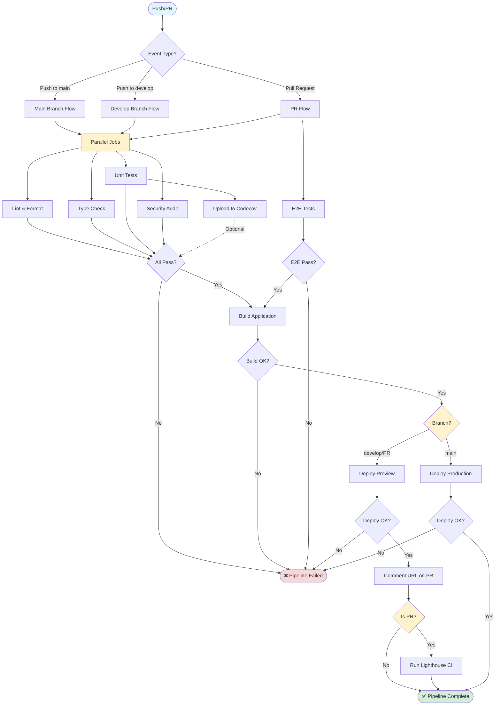
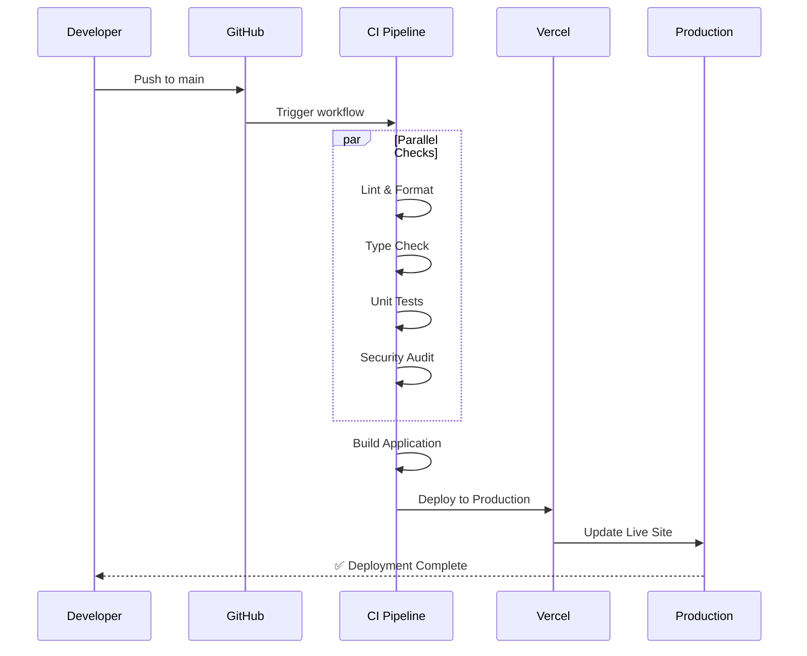
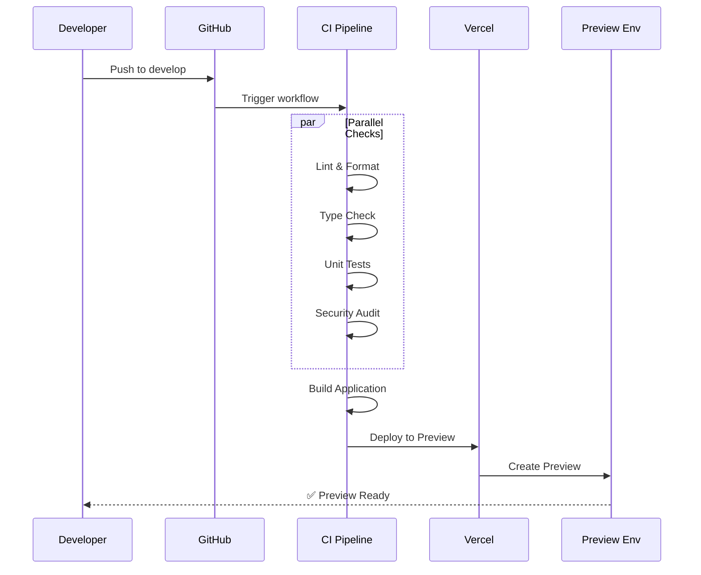
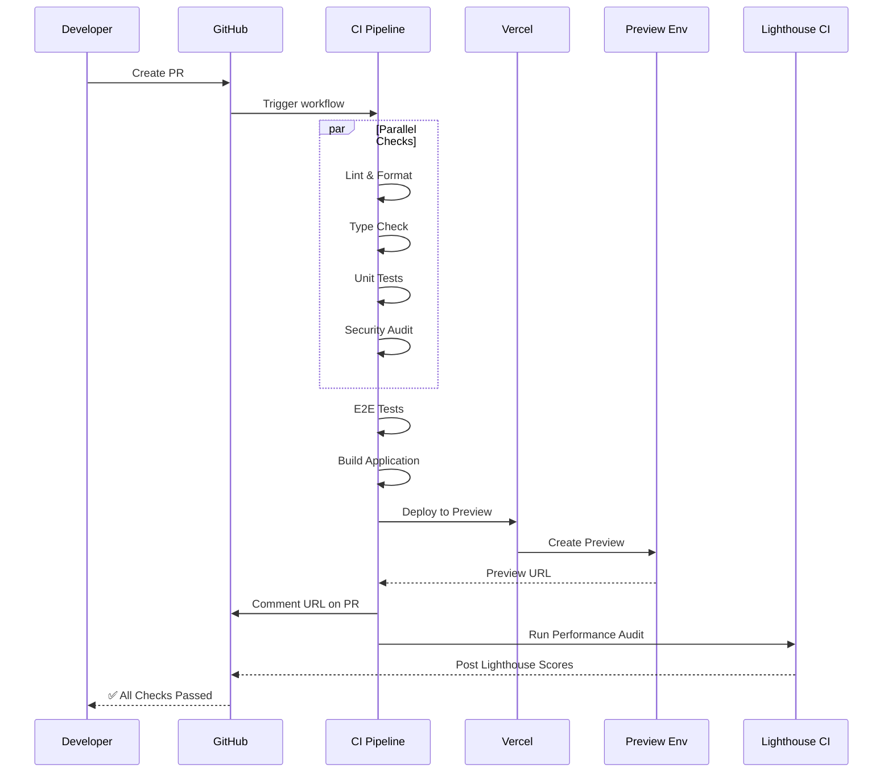
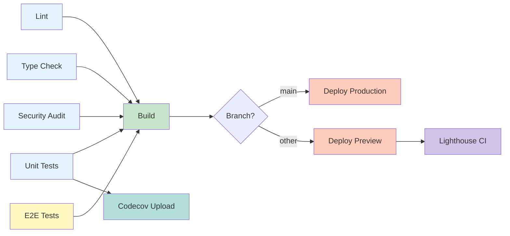
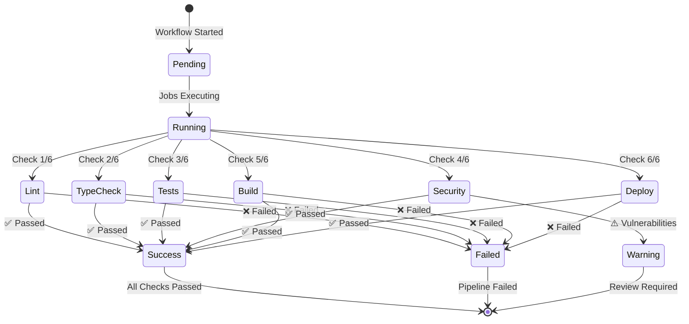
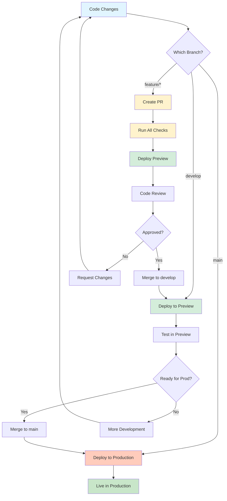
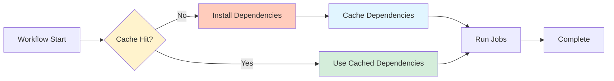
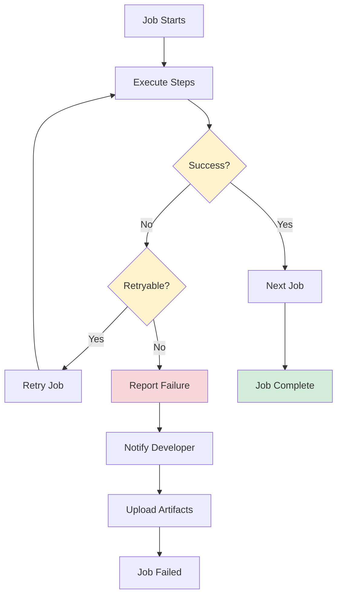
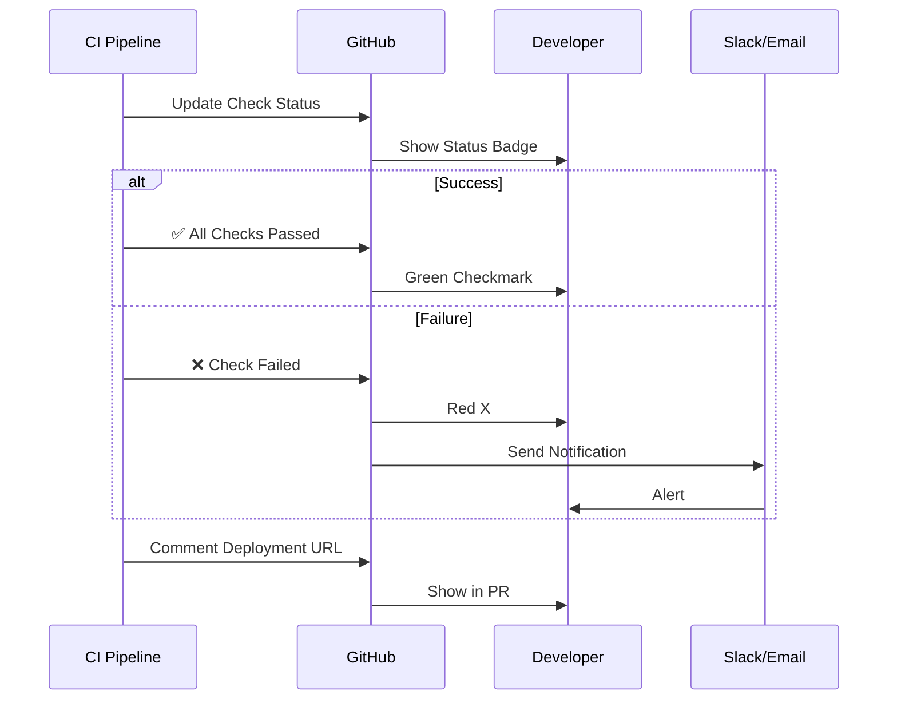

# CI/CD Pipeline Flow Diagram

## Overview

This document provides a visual representation of the CI/CD pipeline flow for the Shaking Head News application.

## Pipeline Architecture



## Detailed Flow by Event Type

### 1. Push to `main` Branch



### 2. Push to `develop` Branch



### 3. Pull Request



## Job Dependencies



## Timeline Visualization

### Typical PR Pipeline (~12-15 minutes)

```
0:00  ├─ Lint & Format (1-2 min)
      ├─ Type Check (1-2 min)
      ├─ Unit Tests (2-3 min)
      └─ Security Audit (0.5 min)

3:00  └─ E2E Tests (5-10 min)

8:00  └─ Build (3-5 min)

11:00 └─ Deploy Preview (2-3 min)

13:00 └─ Lighthouse CI (2-3 min)

15:00 ✅ Complete
```

### Production Deployment (~10-12 minutes)

```
0:00  ├─ Lint & Format (1-2 min)
      ├─ Type Check (1-2 min)
      ├─ Unit Tests (2-3 min)
      └─ Security Audit (0.5 min)

3:00  └─ Build (3-5 min)

8:00  └─ Deploy Production (2-3 min)

11:00 ✅ Complete
```

## Status Check Flow



## Deployment Strategy



## Caching Strategy



## Error Handling Flow



## Notification Flow



## Legend

### Status Colors

- 🟦 **Blue**: Start/Input
- 🟩 **Green**: Success/Complete
- 🟥 **Red**: Failure/Error
- 🟨 **Yellow**: Decision/Warning
- 🟪 **Purple**: Optional/Info

### Job Types

- **Parallel**: Jobs that run simultaneously
- **Sequential**: Jobs that run one after another
- **Conditional**: Jobs that run based on conditions
- **Optional**: Jobs that don't block the pipeline

---

**Last Updated**: 2025-01-13
**Version**: 1.0.0
