# CI/CD Pipeline Flow Diagram

## Overview

This document provides a visual representation of the CI/CD pipeline flow for the Shaking Head News application.

## Pipeline Architecture

```mermaid
graph TB
    Start([Push/PR]) --> Trigger{Event Type?}

    Trigger -->|Push to main| MainFlow[Main Branch Flow]
    Trigger -->|Push to develop| DevFlow[Develop Branch Flow]
    Trigger -->|Pull Request| PRFlow[PR Flow]

    MainFlow --> Parallel1[Parallel Jobs]
    DevFlow --> Parallel1
    PRFlow --> Parallel1

    Parallel1 --> Lint[Lint & Format]
    Parallel1 --> TypeCheck[Type Check]
    Parallel1 --> UnitTest[Unit Tests]
    Parallel1 --> Security[Security Audit]

    Lint --> WaitAll{All Pass?}
    TypeCheck --> WaitAll
    UnitTest --> WaitAll
    Security --> WaitAll

    WaitAll -->|No| Fail([❌ Pipeline Failed])
    WaitAll -->|Yes| Build[Build Application]

    Build --> BuildSuccess{Build OK?}
    BuildSuccess -->|No| Fail
    BuildSuccess -->|Yes| DeployDecision{Branch?}

    DeployDecision -->|main| ProdDeploy[Deploy Production]
    DeployDecision -->|develop/PR| PreviewDeploy[Deploy Preview]

    PRFlow --> E2E[E2E Tests]
    E2E --> E2ESuccess{E2E Pass?}
    E2ESuccess -->|No| Fail
    E2ESuccess -->|Yes| Build

    PreviewDeploy --> PreviewSuccess{Deploy OK?}
    PreviewSuccess -->|No| Fail
    PreviewSuccess -->|Yes| CommentPR[Comment URL on PR]

    CommentPR --> Lighthouse{Is PR?}
    Lighthouse -->|Yes| LighthouseRun[Run Lighthouse CI]
    Lighthouse -->|No| Success

    LighthouseRun --> Success([✅ Pipeline Complete])

    ProdDeploy --> ProdSuccess{Deploy OK?}
    ProdSuccess -->|No| Fail
    ProdSuccess -->|Yes| Success

    UnitTest --> Coverage[Upload to Codecov]
    Coverage -.Optional.-> WaitAll

    style Start fill:#e1f5ff
    style Success fill:#d4edda
    style Fail fill:#f8d7da
    style Parallel1 fill:#fff3cd
    style DeployDecision fill:#fff3cd
    style Lighthouse fill:#fff3cd
```



## Detailed Flow by Event Type

### 1. Push to `main` Branch


### 2. Push to `develop` Branch


### 3. Pull Request

```mermaid
sequenceDiagram
    participant Dev as Developer
    participant GH as GitHub
    participant CI as CI Pipeline
    participant Vercel as Vercel
    participant Preview as Preview Env
    participant LH as Lighthouse CI

    Dev->>GH: Create PR
    GH->>CI: Trigger workflow

    par Parallel Checks
        CI->>CI: Lint & Format
        CI->>CI: Type Check
        CI->>CI: Unit Tests
        CI->>CI: Security Audit
    end

    CI->>CI: E2E Tests
    CI->>CI: Build Application
    CI->>Vercel: Deploy to Preview
    Vercel->>Preview: Create Preview
    Preview-->>CI: Preview URL
    CI->>GH: Comment URL on PR
    CI->>LH: Run Performance Audit
    LH-->>GH: Post Lighthouse Scores
    GH-->>Dev: ✅ All Checks Passed
```



## Job Dependencies


## Timeline Visualization

### Typical PR Pipeline (~12-15 minutes)

```
0:00  ├─ Lint & Format (1-2 min)
      ├─ Type Check (1-2 min)
      ├─ Unit Tests (2-3 min)
      └─ Security Audit (0.5 min)

3:00  └─ E2E Tests (5-10 min)

8:00  └─ Build (3-5 min)

11:00 └─ Deploy Preview (2-3 min)

13:00 └─ Lighthouse CI (2-3 min)

15:00 ✅ Complete
```

### Production Deployment (~10-12 minutes)

```
0:00  ├─ Lint & Format (1-2 min)
      ├─ Type Check (1-2 min)
      ├─ Unit Tests (2-3 min)
      └─ Security Audit (0.5 min)

3:00  └─ Build (3-5 min)

8:00  └─ Deploy Production (2-3 min)

11:00 ✅ Complete
```

## Status Check Flow

```mermaid
stateDiagram-v2
    [*] --> Pending: Workflow Started

    Pending --> Running: Jobs Executing

    Running --> Lint: Check 1/6
    Running --> TypeCheck: Check 2/6
    Running --> Tests: Check 3/6
    Running --> Security: Check 4/6
    Running --> Build: Check 5/6
    Running --> Deploy: Check 6/6

    Lint --> Success: ✅ Passed
    Lint --> Failed: ❌ Failed

    TypeCheck --> Success: ✅ Passed
    TypeCheck --> Failed: ❌ Failed

    Tests --> Success: ✅ Passed
    Tests --> Failed: ❌ Failed

    Security --> Success: ✅ Passed
    Security --> Warning: ⚠️ Vulnerabilities

    Build --> Success: ✅ Passed
    Build --> Failed: ❌ Failed

    Deploy --> Success: ✅ Passed
    Deploy --> Failed: ❌ Failed

    Success --> [*]: All Checks Passed
    Failed --> [*]: Pipeline Failed
    Warning --> [*]: Review Required
```



## Deployment Strategy


## Caching Strategy


## Error Handling Flow


## Notification Flow


## Legend

### Status Colors

- 🟦 **Blue**: Start/Input
- 🟩 **Green**: Success/Complete
- 🟥 **Red**: Failure/Error
- 🟨 **Yellow**: Decision/Warning
- 🟪 **Purple**: Optional/Info

### Job Types

- **Parallel**: Jobs that run simultaneously
- **Sequential**: Jobs that run one after another
- **Conditional**: Jobs that run based on conditions
- **Optional**: Jobs that don't block the pipeline

---

**Last Updated**: 2025-01-13
**Version**: 1.0.0
