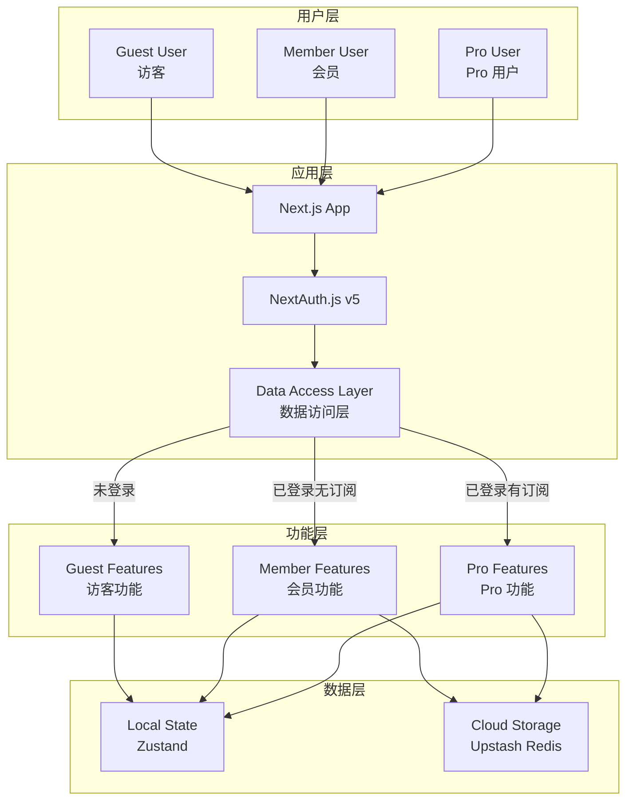
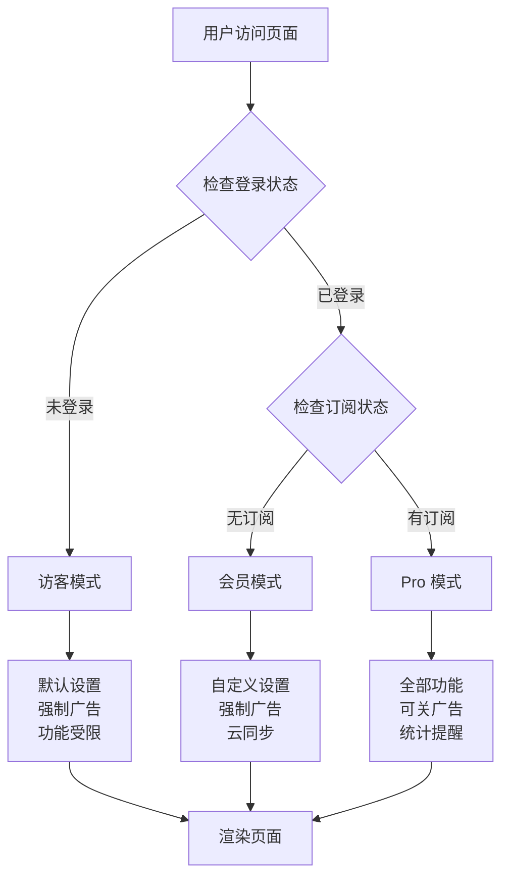
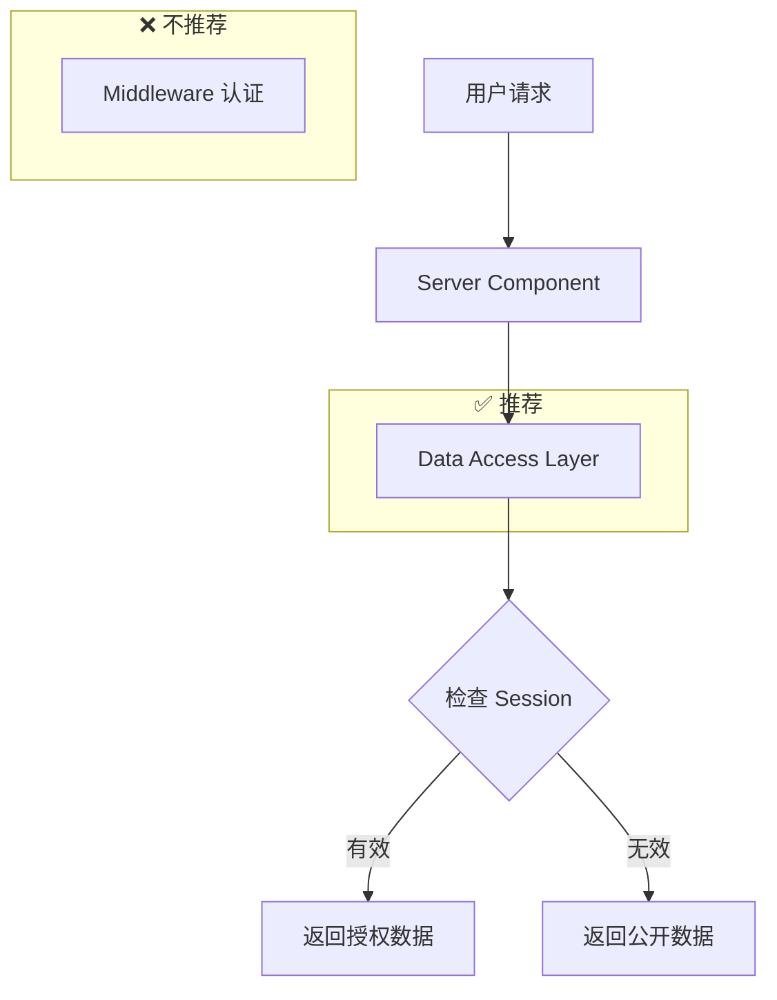
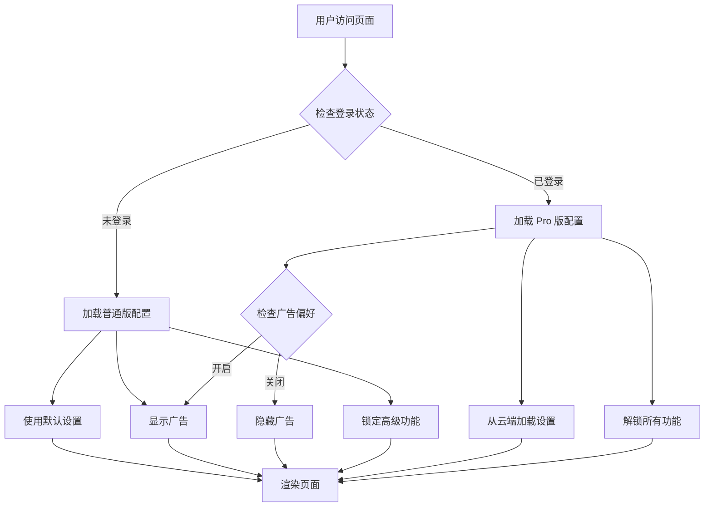

# Design Document: Project Merge (Three-Tier User System)

## Overview

本设计文档描述如何将 shaking-news 和 shaking-head-news 合并为一个统一代码库。核心设计理念是**三层用户模式**：
- **访客 (Guest)**：即开即用，无需登录
- **会员 (Member)**：免费登录，解锁自定义功能
- **Pro**：付费订阅（未来），解锁高级功能

### 技术栈最佳实践 (2025)

基于 Next.js 16、React 19 和 NextAuth v5 的最新最佳实践：

1. **认证安全**：不再依赖 middleware 进行认证检查，改用 Data Access Layer (DAL) 模式
2. **Server Components**：优先使用 Server Components，减少客户端 JavaScript
3. **状态管理**：Zustand 适合本项目（轻量、简单、与 React 19 兼容）
4. **认证检查**：在数据访问层进行认证检查，而非 middleware

## Architecture

### 高层架构图



### 用户层级流程



### 认证架构 (NextAuth v5 最佳实践)



**重要变更**：根据 Next.js 2025 安全指南 (CVE-2025-29927)，不再使用 middleware 进行认证检查。认证逻辑应放在 Data Access Layer 中，靠近数据访问点。

### 功能开关流程



## Components and Interfaces

### 1. Data Access Layer (数据访问层) - 2025 最佳实践

```typescript
// lib/dal/auth.ts
import { auth } from '@/lib/auth'
import { cache } from 'react'

// 使用 React cache 避免重复调用
export const getCurrentUser = cache(async () => {
  const session = await auth()
  if (!session?.user) {
    return null
  }
  return session.user
})

// 验证用户是否已认证
export const verifyAuth = cache(async () => {
  const user = await getCurrentUser()
  if (!user) {
    throw new Error('Unauthorized')
  }
  return user
})
```

```typescript
// lib/dal/settings.ts
import { getCurrentUser } from './auth'
import { redis } from '@/lib/storage'
import { DEFAULT_SETTINGS, UserSettings } from '@/lib/config/defaults'

// 获取用户设置 - 在数据访问层进行认证检查
export async function getUserSettings(): Promise<UserSettings> {
  const user = await getCurrentUser()
  
  // 未登录用户返回默认设置
  if (!user) {
    return DEFAULT_SETTINGS
  }
  
  // 已登录用户从云端加载设置
  try {
    const settings = await redis.get(`user:${user.id}:settings`)
    return settings ? { ...DEFAULT_SETTINGS, ...settings } : DEFAULT_SETTINGS
  } catch {
    // 云端不可用时返回默认设置
    return DEFAULT_SETTINGS
  }
}

// 保存用户设置 - 需要认证
export async function saveUserSettings(settings: Partial<UserSettings>): Promise<void> {
  const user = await getCurrentUser()
  
  if (!user) {
    throw new Error('Must be logged in to save settings')
  }
  
  await redis.set(`user:${user.id}:settings`, settings)
}
```

### 2. Feature Gate System (功能开关系统)

```typescript
// lib/config/features.ts

export type UserTier = 'guest' | 'member' | 'pro'

export interface FeatureConfig {
  // 旋转设置
  rotationModeSelectable: boolean      // 是否可选择旋转模式
  rotationIntervalAdjustable: boolean  // 是否可调节旋转间隔
  rotationAngleAdjustable: boolean     // 是否可调节旋转角度
  
  // 显示设置
  fontSizeAdjustable: boolean          // 是否可调节字体大小
  layoutModeSelectable: boolean        // 是否可选择布局模式
  
  // 新闻源
  customRssEnabled: boolean            // 是否可自定义 RSS
  opmlImportExportEnabled: boolean     // 是否支持 OPML
  
  // 广告
  adsDisableable: boolean              // 是否可关闭广告
  
  // 统计
  statsPreviewEnabled: boolean         // 是否显示统计预览
  statsFullEnabled: boolean            // 是否显示完整统计
  healthRemindersEnabled: boolean      // 是否启用健康提醒
  exerciseGoalsEnabled: boolean        // 是否启用运动目标
  
  // 其他
  keyboardShortcutsEnabled: boolean    // 是否启用键盘快捷键
  cloudSyncEnabled: boolean            // 是否启用云同步
}

export const GUEST_FEATURES: FeatureConfig = {
  rotationModeSelectable: false,
  rotationIntervalAdjustable: false,
  rotationAngleAdjustable: false,
  fontSizeAdjustable: false,
  layoutModeSelectable: false,
  customRssEnabled: false,
  opmlImportExportEnabled: false,
  adsDisableable: false,
  statsPreviewEnabled: false,
  statsFullEnabled: false,
  healthRemindersEnabled: false,
  exerciseGoalsEnabled: false,
  keyboardShortcutsEnabled: false,
  cloudSyncEnabled: false,
}

export const MEMBER_FEATURES: FeatureConfig = {
  rotationModeSelectable: true,
  rotationIntervalAdjustable: true,
  rotationAngleAdjustable: true,
  fontSizeAdjustable: true,
  layoutModeSelectable: true,
  customRssEnabled: true,
  opmlImportExportEnabled: false,
  adsDisableable: false,
  statsPreviewEnabled: true,
  statsFullEnabled: false,
  healthRemindersEnabled: false,
  exerciseGoalsEnabled: false,
  keyboardShortcutsEnabled: false,
  cloudSyncEnabled: true,
}

export const PRO_FEATURES: FeatureConfig = {
  rotationModeSelectable: true,
  rotationIntervalAdjustable: true,
  rotationAngleAdjustable: true,
  fontSizeAdjustable: true,
  layoutModeSelectable: true,
  customRssEnabled: true,
  opmlImportExportEnabled: true,
  adsDisableable: true,
  statsPreviewEnabled: true,
  statsFullEnabled: true,
  healthRemindersEnabled: true,
  exerciseGoalsEnabled: true,
  keyboardShortcutsEnabled: true,
  cloudSyncEnabled: true,
}

export function getFeaturesForTier(tier: UserTier): FeatureConfig {
  switch (tier) {
    case 'pro': return PRO_FEATURES
    case 'member': return MEMBER_FEATURES
    default: return GUEST_FEATURES
  }
}
```

### 3. useUserTier Hook (客户端)

```typescript
// hooks/use-user-tier.ts
'use client'

import { useSession } from 'next-auth/react'
import { GUEST_FEATURES, MEMBER_FEATURES, PRO_FEATURES, FeatureConfig, UserTier, getFeaturesForTier } from '@/lib/config/features'

export function useUserTier() {
  const { data: session, status } = useSession()
  
  // 判断用户层级
  let tier: UserTier = 'guest'
  if (session) {
    // 检查是否有 Pro 订阅（未来实现）
    const hasProSubscription = session.user?.subscription === 'pro'
    tier = hasProSubscription ? 'pro' : 'member'
  }
  
  const features: FeatureConfig = getFeaturesForTier(tier)
  const isLoading = status === 'loading'
  const isAuthenticated = !!session
  const isGuest = tier === 'guest'
  const isMember = tier === 'member'
  const isPro = tier === 'pro'
  
  return {
    tier,
    features,
    isLoading,
    isAuthenticated,
    isGuest,
    isMember,
    isPro,
    user: session?.user,
  }
}
```

### 4. Server Component 层级检查

```typescript
// lib/tier-server.ts
import { getCurrentUser } from '@/lib/dal/auth'
import { GUEST_FEATURES, MEMBER_FEATURES, PRO_FEATURES, UserTier, getFeaturesForTier } from '@/lib/config/features'

// 用于 Server Components
export async function getUserTier() {
  const user = await getCurrentUser()
  
  let tier: UserTier = 'guest'
  if (user) {
    // 检查是否有 Pro 订阅（未来实现）
    const hasProSubscription = user.subscription === 'pro'
    tier = hasProSubscription ? 'pro' : 'member'
  }
  
  return {
    tier,
    features: getFeaturesForTier(tier),
    isGuest: tier === 'guest',
    isMember: tier === 'member',
    isPro: tier === 'pro',
    user,
  }
}
```

### 5. TierFeature Component (层级功能包装组件)

```typescript
// components/tier/TierFeature.tsx
'use client'

import { useUserTier } from '@/hooks/use-user-tier'
import { FeatureConfig } from '@/lib/config/features'

interface TierFeatureProps {
  feature: keyof FeatureConfig
  children: React.ReactNode
  fallback?: React.ReactNode
  showLock?: boolean
  requiredTier?: 'member' | 'pro'
}

export function TierFeature({ 
  feature, 
  children, 
  fallback,
  showLock = true,
  requiredTier
}: TierFeatureProps) {
  const { features, tier } = useUserTier()
  
  if (features[feature]) {
    return <>{children}</>
  }
  
  if (fallback) {
    return <>{fallback}</>
  }
  
  if (showLock) {
    return <LockedFeature featureName={feature} requiredTier={requiredTier} />
  }
  
  return null
}
```

### 6. User Badge Component

```typescript
// components/tier/UserBadge.tsx
'use client'

import { useUserTier } from '@/hooks/use-user-tier'

export function UserBadge() {
  const { tier, isGuest } = useUserTier()
  
  if (isGuest) return null
  
  const badgeConfig = {
    member: { label: '会员', className: 'bg-blue-100 text-blue-800' },
    pro: { label: 'Pro', className: 'bg-gradient-to-r from-purple-500 to-pink-500 text-white' },
  }
  
  const config = badgeConfig[tier as 'member' | 'pro']
  
  return (
    <span className={`px-2 py-0.5 rounded-full text-xs font-medium ${config.className}`}>
      {config.label}
    </span>
  )
}
```

### 4. Default Settings (默认设置)

```typescript
// lib/config/defaults.ts

export const DEFAULT_SETTINGS = {
  // 旋转设置 (普通版固定值)
  rotationMode: 'continuous' as const,
  rotationInterval: 30,  // 秒
  tiltAngle: 15,         // 度
  
  // 显示设置
  fontSize: 'medium' as const,
  layoutMode: 'normal' as const,
  theme: 'system' as const,
  language: 'zh' as const,
  
  // 广告设置
  adsEnabled: true,
  
  // 统计设置
  dailyGoal: 50,
  healthRemindersEnabled: true,
}

export type UserSettings = typeof DEFAULT_SETTINGS
```

## Data Models

### 用户设置数据模型

```typescript
// types/settings.ts

export interface UserSettings {
  // 旋转设置
  rotationMode: 'fixed' | 'continuous'
  rotationInterval: number  // 5-60 秒
  tiltAngle: number         // 8-25 度
  
  // 显示设置
  fontSize: 'small' | 'medium' | 'large' | 'xlarge'
  layoutMode: 'compact' | 'normal'
  theme: 'light' | 'dark' | 'system'
  language: 'zh' | 'en'
  
  // 广告设置
  adsEnabled: boolean
  
  // 统计设置
  dailyGoal: number
  healthRemindersEnabled: boolean
}

export interface UserStats {
  totalRotations: number
  todayRotations: number
  streakDays: number
  lastActiveDate: string
  dailyHistory: DailyStats[]
}

export interface DailyStats {
  date: string
  rotations: number
  duration: number  // 分钟
}
```

### 云存储数据结构 (Redis)

```typescript
// Redis Key 结构
// user:{userId}:settings -> UserSettings JSON
// user:{userId}:stats -> UserStats JSON
// user:{userId}:rss -> RSSSource[] JSON
```

## Components Structure

### 目录结构

```
components/
├── pro/                          # Pro 版专属组件
│   ├── ProFeature.tsx           # Pro 功能包装器
│   ├── ProBadge.tsx             # Pro 徽章
│   ├── UpgradePrompt.tsx        # 升级提示
│   ├── UnlockAnimation.tsx      # 解锁动画
│   └── LockedFeature.tsx        # 锁定功能占位
├── settings/
│   ├── SettingsPanel.tsx        # 设置面板 (根据 edition 显示不同控件)
│   ├── RotationSettings.tsx     # 旋转设置
│   ├── DisplaySettings.tsx      # 显示设置
│   └── AdSettings.tsx           # 广告设置 (Pro only)
├── stats/                        # 统计组件 (Pro only)
│   ├── StatsDisplay.tsx
│   ├── StatsChart.tsx
│   └── BlurredStats.tsx         # 模糊统计 (普通版预览)
├── compare/                      # 版本比较页面
│   ├── ComparisonPage.tsx
│   ├── FeatureRow.tsx
│   └── PricingCard.tsx
└── ads/
    └── AdBanner.tsx             # 广告组件
```

## Page Routes

```
app/
├── page.tsx                      # 首页 (新闻展示)
├── (main)/
│   ├── settings/page.tsx        # 设置页面
│   ├── stats/page.tsx           # 统计页面 (Pro 完整 / 普通版模糊)
│   ├── rss/page.tsx             # RSS 管理 (Pro only)
│   └── compare/page.tsx         # 版本比较页面 (新增)
├── (auth)/
│   └── login/page.tsx           # 登录页面
└── api/
    └── auth/[...nextauth]/route.ts
```


## Correctness Properties

*A property is a characteristic or behavior that should hold true across all valid executions of a system-essentially, a formal statement about what the system should do. Properties serve as the bridge between human-readable specifications and machine-verifiable correctness guarantees.*


Based on the prework analysis, the following correctness properties have been identified:

### Property 1: Feature Availability Based on Authentication State

*For any* user session state (authenticated or unauthenticated), the feature configuration returned by `useEdition()` hook SHALL match the expected edition configuration (STANDARD_FEATURES for unauthenticated, PRO_FEATURES for authenticated).

**Validates: Requirements 1.2, 1.3, 1.4, 4.4, 4.5**

### Property 2: Default Settings for Unauthenticated Users

*For any* unauthenticated user session, the settings returned by the settings hook SHALL always equal the DEFAULT_SETTINGS constant, regardless of any attempted modifications.

**Validates: Requirements 2.3, 5.1**

### Property 3: Ad Visibility Rules

*For any* user session:
- If unauthenticated: `adsVisible` SHALL always be `true`
- If authenticated: `adsVisible` SHALL equal the user's `adsEnabled` preference

**Validates: Requirements 2.5, 6.1, 6.2, 6.3**

### Property 4: Settings Modification Permissions

*For any* settings modification attempt:
- If unauthenticated: the modification SHALL be rejected and settings SHALL remain unchanged
- If authenticated: the modification SHALL be accepted if the value is within valid range

**Validates: Requirements 2.4, 3.2, 3.4**

### Property 5: Settings Cloud Sync Round-Trip

*For any* valid UserSettings object and authenticated user, saving settings to cloud storage and then loading them back SHALL produce an equivalent UserSettings object.

**Validates: Requirements 3.9, 5.2, 5.3, 6.4**

### Property 6: OPML Import/Export Round-Trip

*For any* valid array of RSS sources, exporting to OPML format and then importing back SHALL produce an equivalent array of RSS sources.

**Validates: Requirements 3.5**

### Property 7: RSS Source Management Invariants

*For any* authenticated user with a list of RSS sources:
- Adding a source SHALL increase the list length by 1
- Removing a source SHALL decrease the list length by 1
- The list SHALL never contain duplicate URLs

**Validates: Requirements 3.4**

## Error Handling

### Authentication Errors

| Error | Handling |
|-------|----------|
| OAuth provider unavailable | Show error message, offer alternative login method |
| Session expired | Redirect to login page, preserve current page URL |
| Invalid session token | Clear session, revert to Standard Edition |

### Storage Errors

| Error | Handling |
|-------|----------|
| Cloud storage unavailable | Fallback to localStorage, show warning banner |
| Settings load failure | Use default settings, retry in background |
| Settings save failure | Queue for retry, show error toast |

### Network Errors

| Error | Handling |
|-------|----------|
| News API unavailable | Show cached content or placeholder |
| RSS feed fetch failure | Show error for specific feed, continue with others |

## Testing Strategy

### Unit Tests

Unit tests will cover:
- `useEdition` hook behavior for different session states
- Feature configuration constants
- Settings validation functions
- OPML parser and serializer

### Property-Based Tests

Property-based tests will use `fast-check` library to verify:
- Property 1: Feature availability (100+ iterations)
- Property 2: Default settings immutability (100+ iterations)
- Property 3: Ad visibility rules (100+ iterations)
- Property 4: Settings modification permissions (100+ iterations)
- Property 5: Settings round-trip (100+ iterations)
- Property 6: OPML round-trip (100+ iterations)
- Property 7: RSS source management (100+ iterations)

### Integration Tests

Integration tests will cover:
- Login/logout flow
- Settings persistence across sessions
- Feature unlock animation trigger

### E2E Tests

E2E tests using Playwright will cover:
- Guest user journey (view news, see locked features)
- Pro user journey (login, customize settings, view stats)
- Comparison page navigation and content
- Responsive design on mobile viewports

## UI Component Specifications

### LockedFeature Component

```typescript
interface LockedFeatureProps {
  featureName: string
  description?: string
  onLoginClick?: () => void
}
```

Displays a locked state with:
- Lock icon
- Feature name
- "Login to unlock" button
- Optional description

### UpgradePrompt Component

```typescript
interface UpgradePromptProps {
  variant: 'banner' | 'modal' | 'inline'
  onLogin: () => void
  onDismiss?: () => void
}
```

Variants:
- `banner`: Subtle top banner for guest users
- `modal`: Full modal when clicking locked feature
- `inline`: Small inline prompt next to locked controls

### ComparisonPage Layout

```
┌─────────────────────────────────────────────────────┐
│                    Header                           │
├─────────────────────────────────────────────────────┤
│                                                     │
│   ┌─────────────────┐   ┌─────────────────┐        │
│   │   Standard      │   │      Pro        │        │
│   │   🆓 Free       │   │   🆓 Free       │        │
│   │                 │   │   (Login)       │        │
│   │ ✓ Basic news    │   │ ✓ Everything    │        │
│   │ ✓ Rotation      │   │ ✓ Custom RSS    │        │
│   │ ✓ Dark mode     │   │ ✓ Statistics    │        │
│   │ ✗ Custom RSS    │   │ ✓ No ads        │        │
│   │ ✗ Statistics    │   │ ✓ Cloud sync    │        │
│   │                 │   │                 │        │
│   │ [Current Plan]  │   │ [Login Free]    │        │
│   └─────────────────┘   └─────────────────┘        │
│                                                     │
└─────────────────────────────────────────────────────┘
```


## 2025 最佳实践总结

### ✅ 采用的最佳实践 (Context7 验证)

| 实践 | 说明 | 来源 |
|-----|------|------|
| **Data Access Layer (DAL)** | 集中数据访问逻辑，在 DAL 中进行认证检查 | Next.js 官方文档 |
| **Data Transfer Objects (DTO)** | 只返回必要的数据，减少敏感信息泄露风险 | Next.js 数据安全指南 |
| **Server Components 认证** | 使用 `verifySession()` 在 Server Components 中检查认证 | Next.js 认证指南 |
| **Server Actions 保护** | 在 Server Actions 中验证用户权限 | Next.js 数据安全指南 |
| **Auth.js v5 Middleware** | 使用 `auth` 导出作为 middleware wrapper | Auth.js v5 迁移指南 |
| **React cache()** | 避免重复认证调用 | React 19 最佳实践 |

### Auth.js v5 认证方法对照表

| 场景 | v4 | v5 |
|-----|----|----|
| Server Component | `getServerSession(authOptions)` | `auth()` 调用 |
| Middleware | `withAuth(middleware, ...)` | `auth` 导出 / `auth()` wrapper |
| Client Component | `useSession()` hook | `useSession()` hook |
| Route Handler | 不支持 | `auth()` wrapper |
| API Route | `getServerSession(req, res, authOptions)` | `auth(req, res)` 调用 |

### 关键架构决策

1. **DAL 模式**：所有数据访问通过 Data Access Layer，集中认证和授权逻辑
2. **DTO 模式**：只返回必要的用户数据，避免敏感信息泄露
3. **Middleware 用途**：用于路由重定向（如未登录跳转登录页），而非数据保护
4. **Server Actions 保护**：每个 Server Action 都需要验证用户权限

### 设计验证结果

✅ **DAL 实现正确**：`lib/dal/auth.ts` 和 `lib/dal/settings.ts` 符合 Next.js 推荐模式
✅ **认证检查位置正确**：在数据访问层进行，而非仅依赖 middleware
✅ **Auth.js v5 API 正确**：使用 `auth()` 函数获取 session
✅ **Server/Client 分离正确**：提供两个版本的 ProFeature 组件
