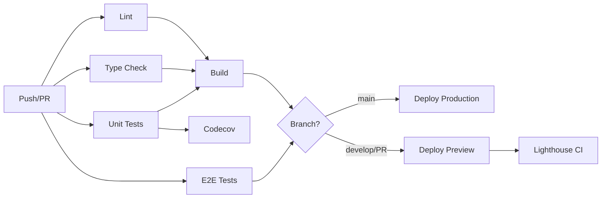

# CI/CD Configuration Guide

## Overview

This document describes the CI/CD pipeline configuration for the Shaking Head News application. The pipeline is built using GitHub Actions and integrates with Vercel for automated deployments.

## Pipeline Architecture



## Jobs Description

### 1. Lint & Format Check
- **Purpose**: Ensures code quality and consistent formatting
- **Runs**: ESLint and Prettier checks
- **Triggers**: All pushes and PRs
- **Duration**: ~1-2 minutes

### 2. TypeScript Type Check
- **Purpose**: Validates TypeScript types across the codebase
- **Runs**: `tsc --noEmit`
- **Triggers**: All pushes and PRs
- **Duration**: ~1-2 minutes

### 3. Unit & Integration Tests
- **Purpose**: Runs all unit and integration tests with coverage
- **Runs**: Vitest with coverage reporting
- **Triggers**: All pushes and PRs
- **Coverage**: Uploads to Codecov
- **Duration**: ~2-3 minutes

### 4. E2E Tests (Playwright)
- **Purpose**: Validates critical user journeys
- **Runs**: Playwright tests in headless Chromium
- **Triggers**: All pushes and PRs
- **Artifacts**: Playwright HTML report (retained for 7 days)
- **Duration**: ~5-10 minutes

### 5. Build Application
- **Purpose**: Ensures the application builds successfully
- **Runs**: Next.js production build
- **Triggers**: After lint, type-check, and tests pass
- **Artifacts**: Build output (retained for 7 days)
- **Duration**: ~3-5 minutes

### 6. Security Audit
- **Purpose**: Checks for known vulnerabilities in dependencies
- **Runs**: `npm audit`
- **Triggers**: All pushes and PRs
- **Continues**: Even if vulnerabilities found (non-blocking)
- **Duration**: ~30 seconds

### 7. Deploy to Production
- **Purpose**: Deploys to Vercel production environment
- **Triggers**: Only on `main` branch pushes
- **Requires**: All tests and build to pass
- **Environment**: production
- **Duration**: ~2-3 minutes

### 8. Deploy to Preview
- **Purpose**: Creates preview deployments for testing
- **Triggers**: PRs and `develop` branch pushes
- **Environment**: preview
- **Comments**: Adds deployment URL to PR
- **Duration**: ~2-3 minutes

### 9. Lighthouse CI
- **Purpose**: Performance and accessibility audits
- **Triggers**: Only on PRs after preview deployment
- **Checks**: Performance, Accessibility, Best Practices, SEO
- **Duration**: ~2-3 minutes

## Required Secrets

Configure these secrets in your GitHub repository settings:

### Vercel Secrets
```
VERCEL_TOKEN          # Vercel API token
VERCEL_ORG_ID         # Vercel organization ID
VERCEL_PROJECT_ID     # Vercel project ID
```

### Codecov Secret
```
CODECOV_TOKEN         # Codecov upload token (optional but recommended)
```

## Setup Instructions

### 1. Configure Vercel Integration

#### Option A: Using Vercel CLI
```bash
# Install Vercel CLI
npm i -g vercel

# Login to Vercel
vercel login

# Link your project
vercel link

# Get your project details
vercel project ls
```

#### Option B: Using Vercel Dashboard
1. Go to [Vercel Dashboard](https://vercel.com/dashboard)
2. Select your project
3. Go to Settings → General
4. Copy Project ID and Org ID

#### Get Vercel Token
1. Go to [Vercel Account Settings](https://vercel.com/account/tokens)
2. Create a new token with appropriate scope
3. Copy the token

### 2. Add GitHub Secrets

1. Go to your GitHub repository
2. Navigate to Settings → Secrets and variables → Actions
3. Click "New repository secret"
4. Add the following secrets:

```
Name: VERCEL_TOKEN
Value: [Your Vercel token]

Name: VERCEL_ORG_ID
Value: [Your Vercel org ID]

Name: VERCEL_PROJECT_ID
Value: [Your Vercel project ID]
```

### 3. Configure Codecov (Optional)

1. Go to [Codecov](https://codecov.io/)
2. Sign in with GitHub
3. Add your repository
4. Copy the upload token
5. Add as GitHub secret:

```
Name: CODECOV_TOKEN
Value: [Your Codecov token]
```

### 4. Configure Branch Protection

Recommended branch protection rules for `main`:

1. Go to Settings → Branches → Add rule
2. Branch name pattern: `main`
3. Enable:
   - ✅ Require a pull request before merging
   - ✅ Require status checks to pass before merging
   - ✅ Require branches to be up to date before merging
   - Required status checks:
     - `Lint & Format Check`
     - `TypeScript Type Check`
     - `Unit & Integration Tests`
     - `Build Application`
   - ✅ Require conversation resolution before merging
   - ✅ Do not allow bypassing the above settings

## Environment Variables

The CI pipeline uses mock environment variables for testing. For actual deployments, configure these in Vercel:

### Required Environment Variables
```bash
# Authentication
NEXTAUTH_SECRET=          # Generate with: openssl rand -base64 32
NEXTAUTH_URL=             # Your production URL

# Google OAuth
GOOGLE_CLIENT_ID=         # From Google Cloud Console
GOOGLE_CLIENT_SECRET=     # From Google Cloud Console

# Upstash Redis
UPSTASH_REDIS_REST_URL=   # From Upstash dashboard
UPSTASH_REDIS_REST_TOKEN= # From Upstash dashboard

# Optional
NEXT_PUBLIC_APP_URL=      # Your app URL for client-side
```

### Configure in Vercel
1. Go to your Vercel project
2. Navigate to Settings → Environment Variables
3. Add each variable for Production, Preview, and Development
4. Save changes

## Workflow Triggers

### Push to `main`
```
Lint → Type Check → Tests → Build → Deploy Production
```

### Push to `develop`
```
Lint → Type Check → Tests → Build → Deploy Preview
```

### Pull Request
```
Lint → Type Check → Tests → E2E → Build → Deploy Preview → Lighthouse CI
```

## Performance Optimization

### Caching Strategy
- **Node modules**: Cached using `actions/setup-node` with `cache: 'npm'`
- **Build output**: Cached by Vercel automatically
- **Playwright browsers**: Installed only when needed

### Concurrency Control
- Cancels in-progress runs for the same branch
- Prevents redundant builds on rapid commits

### Parallel Execution
- Lint, Type Check, Tests, and Security Audit run in parallel
- Reduces total pipeline time by ~50%

## Monitoring and Notifications

### GitHub Checks
- All jobs appear as checks on PRs
- Failed checks block merging (if branch protection enabled)

### PR Comments
- Preview deployment URL automatically commented
- Production deployment URL commented on merge

### Codecov Reports
- Coverage reports appear as PR comments
- Shows coverage diff for changed files

### Lighthouse Reports
- Performance scores appear in PR checks
- Detailed reports available in artifacts

## Troubleshooting

### Build Failures

#### "Module not found" errors
```bash
# Clear cache and reinstall
rm -rf node_modules package-lock.json
npm install
```

#### Type check failures
```bash
# Run locally to debug
npm run type-check
```

### Deployment Failures

#### Vercel token expired
1. Generate new token in Vercel dashboard
2. Update `VERCEL_TOKEN` secret in GitHub

#### Environment variables missing
1. Check Vercel project settings
2. Ensure all required variables are set
3. Redeploy

### Test Failures

#### E2E tests timeout
- Increase timeout in `playwright.config.ts`
- Check if preview deployment is accessible

#### Coverage upload fails
- Verify `CODECOV_TOKEN` is correct
- Check Codecov service status

## Best Practices

### Commit Messages
Follow [Conventional Commits](https://www.conventionalcommits.org/):
```
feat: add new feature
fix: fix bug
docs: update documentation
style: format code
refactor: refactor code
test: add tests
chore: update dependencies
```

### Pull Request Workflow
1. Create feature branch from `develop`
2. Make changes and commit
3. Push and create PR to `develop`
4. Wait for all checks to pass
5. Request review
6. Merge after approval
7. Delete feature branch

### Release Workflow
1. Merge `develop` to `main`
2. Tag release: `git tag v2.0.0`
3. Push tag: `git push origin v2.0.0`
4. Production deployment triggers automatically

## Cost Optimization

### GitHub Actions
- Free tier: 2,000 minutes/month for private repos
- Public repos: Unlimited
- Current usage: ~15-20 minutes per PR

### Vercel
- Hobby plan: Unlimited deployments
- Pro plan: Required for team features
- Preview deployments: Automatically cleaned up after 30 days

### Codecov
- Free for open source
- Paid plans for private repos

## Maintenance

### Regular Tasks
- [ ] Review and update dependencies monthly
- [ ] Check GitHub Actions usage
- [ ] Monitor Codecov coverage trends
- [ ] Review Lighthouse scores
- [ ] Update Node.js version annually

### Security Updates
- Dependabot automatically creates PRs for security updates
- Review and merge promptly
- Test thoroughly before deploying

## Additional Resources

- [GitHub Actions Documentation](https://docs.github.com/en/actions)
- [Vercel Deployment Documentation](https://vercel.com/docs/deployments/overview)
- [Codecov Documentation](https://docs.codecov.com/)
- [Lighthouse CI Documentation](https://github.com/GoogleChrome/lighthouse-ci)

## Support

For issues with the CI/CD pipeline:
1. Check GitHub Actions logs
2. Review this documentation
3. Check Vercel deployment logs
4. Open an issue in the repository
