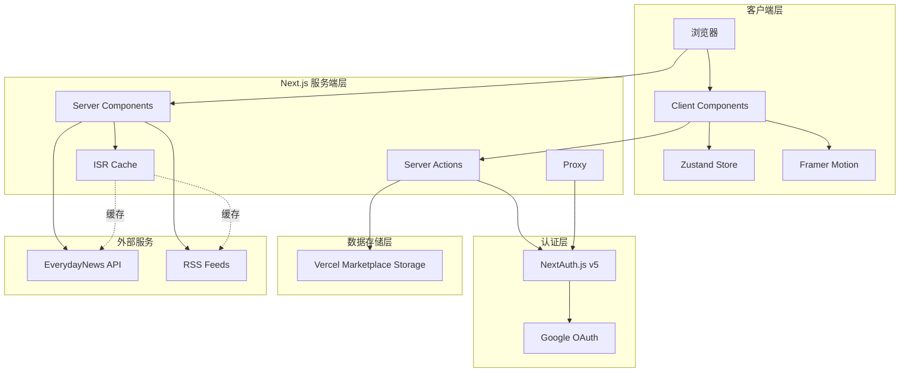
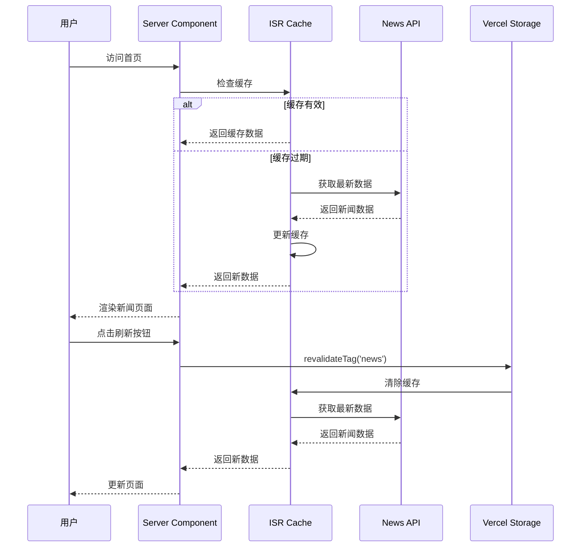
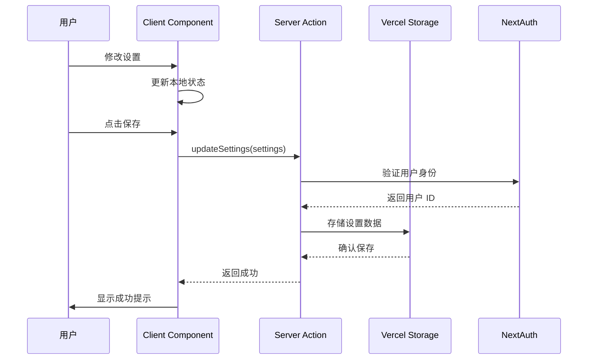

# 设计文档

## 概述

本文档描述"摇头看新闻"Web 应用的技术架构设计。项目将从 Vue 3 浏览器扩展迁移到基于 Next.js 15 + React 19 的现代化全栈 Web 应用，采用 Server Components、Server Actions 和 ISR 等最新技术，实现高性能、可扩展的新闻阅读和颈椎健康促进平台。

### 核心技术栈

```
📦 核心框架
├─ Next.js 15 (App Router + Server Components + ISR)
├─ React 19 (Server Components + Client Components)
└─ TypeScript 5.7+ (严格模式)

🎨 UI 层
├─ Tailwind CSS 4
├─ Shadcn/ui (可复制组件)
├─ Radix UI (无障碍底层)
├─ Framer Motion (页面旋转动画)
├─ Lucide React (图标)
└─ next-themes (主题切换)

🔐 认证与存储
├─ NextAuth.js v5 (Google OAuth)
└─ Vercel Marketplace Storage (用户配置存储)

🌐 数据层
├─ Server Actions (数据变更)
├─ 原生 Fetch + ISR (数据获取和缓存)
├─ Zod (数据验证)
└─ next-intl (国际化)

⚡ 状态管理
└─ Zustand (客户端 UI 状态)

🛠️ 开发工具
├─ Turbopack (构建)
├─ ESLint 9 + Prettier
├─ Husky + lint-staged
├─ Commitizen
└─ @next/bundle-analyzer

🧪 测试
├─ Vitest (单元测试)
├─ React Testing Library (组件测试)
└─ Playwright (E2E 测试)
```

## 架构设计

### 整体架构




### 目录结构

```
shaking-head-news/
├── app/                          # Next.js App Router
│   ├── (auth)/                   # 认证路由组
│   │   ├── login/
│   │   └── callback/
│   ├── (main)/                   # 主应用路由组
│   │   ├── page.tsx              # 首页（新闻展示）
│   │   ├── settings/             # 设置页面
│   │   └── stats/                # 统计页面
│   ├── api/                      # API Routes
│   │   └── auth/[...nextauth]/   # NextAuth 路由
│   ├── layout.tsx                # 根布局
│   └── providers.tsx             # 全局 Providers
├── components/                   # React 组件
│   ├── ui/                       # Shadcn/ui 组件
│   ├── news/                     # 新闻相关组件
│   │   ├── NewsDisplay.tsx       # 新闻展示（Server Component）
│   │   ├── NewsList.tsx          # 新闻列表
│   │   └── NewsItem.tsx          # 新闻项
│   ├── rotation/                 # 旋转相关组件
│   │   ├── TiltWrapper.tsx       # 旋转包装器（Client Component）
│   │   └── RotationControls.tsx # 旋转控制
│   ├── settings/                 # 设置相关组件
│   │   ├── SettingsPanel.tsx
│   │   ├── ThemeToggle.tsx
│   │   └── LanguageSelector.tsx
│   └── layout/                   # 布局组件
│       ├── Header.tsx
│       └── Footer.tsx
├── lib/                           # 核心库和工具
│   ├── actions/                  # Server Actions
│   │   ├── news.ts               # 新闻相关操作
│   │   ├── settings.ts           # 设置相关操作
│   │   └── stats.ts              # 统计相关操作
│   ├── services/                 # 服务层
│   │   ├── news-service.ts       # 新闻数据服务
│   │   ├── rss-service.ts        # RSS 服务
│   │   └── storage-service.ts    # Storage 存储服务
│   ├── stores/                   # Zustand Stores
│   │   ├── rotation-store.ts     # 旋转状态
│   │   └── ui-store.ts           # UI 状态
│   ├── utils/                    # 工具函数
│   │   ├── cache.ts              # 缓存工具
│   │   ├── validation.ts         # 验证工具
│   │   └── format.ts             # 格式化工具
│   ├── auth.ts                   # NextAuth 配置
│   └── storage.ts                # Vercel Marketplace Storage 客户端
├── types/                        # TypeScript 类型定义
│   ├── news.ts
│   ├── user.ts
│   └── settings.ts
├── config/                       # 配置文件
│   ├── site.ts                   # 站点配置
│   └── news-sources.ts           # 新闻源配置
├── messages/                     # 国际化文件
│   ├── en.json
│   └── zh.json
├── public/                       # 静态资源
├── tests/                        # 测试文件
│   ├── unit/
│   ├── integration/
│   └── e2e/
├── proxy.ts                      # Next.js 代理文件（替代 middleware）
├── next.config.js                # Next.js 配置
├── tailwind.config.ts            # Tailwind 配置
├── tsconfig.json                 # TypeScript 配置
└── package.json
```

## 组件设计

### Server Components vs Client Components

**Server Components（服务端组件）：**
- 新闻数据获取和展示
- 用户统计数据展示
- 布局和静态内容
- SEO 相关内容

**Client Components（客户端组件）：**
- 页面旋转动画（Framer Motion）
- 交互式设置面板
- 主题切换
- 实时 UI 状态（Zustand）

### 关键组件设计

#### 1. TiltWrapper（旋转包装器）

```typescript
// components/rotation/TiltWrapper.tsx
'use client'

import { motion } from 'framer-motion'
import { useRotationStore } from '@/lib/stores/rotation-store'
import { useEffect } from 'react'

interface TiltWrapperProps {
  children: React.ReactNode
  mode: 'fixed' | 'continuous'
  interval?: number
}

export function TiltWrapper({ children, mode, interval = 10 }: TiltWrapperProps) {
  const { angle, setAngle, isPaused } = useRotationStore()
  
  useEffect(() => {
    if (isPaused || mode === 'fixed') return
    
    const timer = setInterval(() => {
      // 连续模式：每隔 interval 秒改变角度
      setAngle(Math.random() * 20 - 10) // -10 到 10 度
    }, interval * 1000)
    
    return () => clearInterval(timer)
  }, [mode, interval, isPaused, setAngle])
  
  // 检测 prefers-reduced-motion
  const prefersReducedMotion = 
    typeof window !== 'undefined' && 
    window.matchMedia('(prefers-reduced-motion: reduce)').matches
  
  if (prefersReducedMotion) {
    return <>{children}</>
  }
  
  return (
    <motion.div
      animate={{ rotate: angle }}
      transition={{ duration: 0.6, ease: 'easeInOut' }}
      className="min-h-screen"
    >
      {children}
    </motion.div>
  )
}
```

#### 2. NewsDisplay（新闻展示）

```typescript
// components/news/NewsDisplay.tsx
import { getNews } from '@/lib/actions/news'
import { NewsList } from './NewsList'
import { Suspense } from 'react'
import { NewsListSkeleton } from './NewsListSkeleton'

interface NewsDisplayProps {
  language: 'zh' | 'en'
  source?: string
}

export async function NewsDisplay({ language, source }: NewsDisplayProps) {
  // Server Component 直接获取数据
  const news = await getNews(language, source)
  
  return (
    <div className="container mx-auto px-4 py-8">
      <Suspense fallback={<NewsListSkeleton />}>
        <NewsList news={news} />
      </Suspense>
    </div>
  )
}
```

#### 3. SettingsPanel（设置面板）

```typescript
// components/settings/SettingsPanel.tsx
'use client'

import { useState } from 'react'
import { Button } from '@/components/ui/button'
import { Slider } from '@/components/ui/slider'
import { Switch } from '@/components/ui/switch'
import { updateSettings } from '@/lib/actions/settings'
import { useToast } from '@/components/ui/use-toast'

interface SettingsPanelProps {
  initialSettings: UserSettings
}

export function SettingsPanel({ initialSettings }: SettingsPanelProps) {
  const [settings, setSettings] = useState(initialSettings)
  const { toast } = useToast()
  
  const handleSave = async () => {
    try {
      await updateSettings(settings)
      toast({
        title: '设置已保存',
        description: '您的偏好设置已成功更新'
      })
    } catch (error) {
      toast({
        title: '保存失败',
        description: '请稍后重试',
        variant: 'destructive'
      })
    }
  }
  
  return (
    <div className="space-y-6">
      <div>
        <label>旋转间隔（秒）</label>
        <Slider
          value={[settings.rotationInterval]}
          onValueChange={([value]) => 
            setSettings({ ...settings, rotationInterval: value })
          }
          min={5}
          max={300}
          step={5}
        />
      </div>
      
      <div className="flex items-center justify-between">
        <label>启用动画</label>
        <Switch
          checked={settings.animationEnabled}
          onCheckedChange={(checked) =>
            setSettings({ ...settings, animationEnabled: checked })
          }
        />
      </div>
      
      <Button onClick={handleSave}>保存设置</Button>
    </div>
  )
}
```

## 数据模型

### 用户设置（UserSettings）

```typescript
// types/settings.ts
import { z } from 'zod'

export const UserSettingsSchema = z.object({
  userId: z.string(),
  language: z.enum(['zh', 'en']),
  theme: z.enum(['light', 'dark', 'system']),
  rotationMode: z.enum(['fixed', 'continuous']),
  rotationInterval: z.number().min(5).max(300),
  animationEnabled: z.boolean(),
  fontSize: z.enum(['small', 'medium', 'large', 'xlarge']),
  layoutMode: z.enum(['normal', 'compact']),
  dailyGoal: z.number().min(10).max(100),
  notificationsEnabled: z.boolean(),
  newsSources: z.array(z.string()),
  activeSource: z.string().optional(),
})

export type UserSettings = z.infer<typeof UserSettingsSchema>

export const defaultSettings: Omit<UserSettings, 'userId'> = {
  language: 'zh',
  theme: 'system',
  rotationMode: 'continuous',
  rotationInterval: 10,
  animationEnabled: true,
  fontSize: 'medium',
  layoutMode: 'normal',
  dailyGoal: 30,
  notificationsEnabled: true,
  newsSources: ['everydaynews'],
  activeSource: 'everydaynews',
}
```

### 新闻数据（NewsItem）

```typescript
// types/news.ts
import { z } from 'zod'

export const NewsItemSchema = z.object({
  id: z.string(),
  title: z.string(),
  description: z.string().optional(),
  url: z.string().url(),
  source: z.string(),
  publishedAt: z.string().datetime(),
  category: z.string().optional(),
  imageUrl: z.string().url().optional(),
})

export type NewsItem = z.infer<typeof NewsItemSchema>

export const NewsResponseSchema = z.object({
  items: z.array(NewsItemSchema),
  total: z.number(),
  updatedAt: z.string().datetime(),
})

export type NewsResponse = z.infer<typeof NewsResponseSchema>
```

### 统计数据（UserStats）

```typescript
// types/stats.ts
import { z } from 'zod'

export const RotationRecordSchema = z.object({
  timestamp: z.number(),
  angle: z.number(),
  duration: z.number(), // 持续时间（秒）
})

export type RotationRecord = z.infer<typeof RotationRecordSchema>

export const UserStatsSchema = z.object({
  userId: z.string(),
  date: z.string(), // YYYY-MM-DD
  rotationCount: z.number(),
  totalDuration: z.number(), // 总时长（秒）
  records: z.array(RotationRecordSchema),
})

export type UserStats = z.infer<typeof UserStatsSchema>
```

### RSS 源配置（RSSSource）

```typescript
// types/rss.ts
import { z } from 'zod'

export const RSSSourceSchema = z.object({
  id: z.string(),
  name: z.string(),
  url: z.string().url(),
  description: z.string().optional(),
  language: z.enum(['zh', 'en']),
  enabled: z.boolean(),
  tags: z.array(z.string()),
  order: z.number(),
  lastFetchedAt: z.string().datetime().optional(),
  failureCount: z.number().default(0),
})

export type RSSSource = z.infer<typeof RSSSourceSchema>
```

## 数据流设计

### 新闻数据获取流程



### 用户设置同步流程



## API 设计

### Server Actions

#### 新闻相关操作

```typescript
// lib/actions/news.ts
'use server'

import { cache } from 'react'
import { revalidateTag } from 'next/cache'
import { NewsResponseSchema } from '@/types/news'

// 获取新闻（带 ISR 缓存）
export const getNews = cache(async (language: 'zh' | 'en', source?: string) => {
  const url = source 
    ? `https://news.ravelloh.top/${source}.json?lang=${language}`
    : `https://news.ravelloh.top/latest.json?lang=${language}`
  
  const response = await fetch(url, {
    next: {
      revalidate: 3600, // 1 小时后台重新验证
      tags: ['news', `news-${language}`, source ? `news-${source}` : 'news-latest']
    }
  })
  
  if (!response.ok) {
    throw new Error(`Failed to fetch news: ${response.status}`)
  }
  
  const data = await response.json()
  return NewsResponseSchema.parse(data)
})

// 手动刷新新闻
export async function refreshNews(language?: 'zh' | 'en', source?: string) {
  if (source) {
    revalidateTag(`news-${source}`)
  } else if (language) {
    revalidateTag(`news-${language}`)
  } else {
    revalidateTag('news')
  }
}

// 获取 RSS 源新闻
export async function getRSSNews(rssUrl: string) {
  const response = await fetch(rssUrl, {
    next: {
      revalidate: 1800, // 30 分钟
      tags: [`rss-${rssUrl}`]
    }
  })
  
  if (!response.ok) {
    throw new Error(`Failed to fetch RSS: ${response.status}`)
  }
  
  const xml = await response.text()
  // 解析 RSS XML（使用 fast-xml-parser 或类似库）
  return parseRSS(xml)
}
```

#### 设置相关操作

```typescript
// lib/actions/settings.ts
'use server'

import { auth } from '@/lib/auth'
import { storage } from '@/lib/storage'
import { UserSettingsSchema, defaultSettings } from '@/types/settings'
import { revalidatePath } from 'next/cache'

// 获取用户设置
export async function getUserSettings() {
  const session = await auth()
  
  if (!session?.user?.id) {
    return defaultSettings
  }
  
  const settings = await storage.get(`user:${session.user.id}:settings`)
  
  if (!settings) {
    return { ...defaultSettings, userId: session.user.id }
  }
  
  return UserSettingsSchema.parse(settings)
}

// 更新用户设置
export async function updateSettings(settings: Partial<UserSettings>) {
  const session = await auth()
  
  if (!session?.user?.id) {
    throw new Error('Unauthorized')
  }
  
  const currentSettings = await getUserSettings()
  const newSettings = { ...currentSettings, ...settings, userId: session.user.id }
  
  // 验证数据
  const validatedSettings = UserSettingsSchema.parse(newSettings)
  
  // 存储到 Vercel Storage
  await storage.set(`user:${session.user.id}:settings`, validatedSettings)
  
  // 重新验证相关页面
  revalidatePath('/')
  revalidatePath('/settings')
  
  return validatedSettings
}
```

#### 统计相关操作

```typescript
// lib/actions/stats.ts
'use server'

import { auth } from '@/lib/auth'
import { storage } from '@/lib/storage'
import { UserStatsSchema, RotationRecord } from '@/types/stats'

// 记录旋转
export async function recordRotation(angle: number, duration: number) {
  const session = await auth()
  
  if (!session?.user?.id) {
    return // 未登录用户不记录
  }
  
  const today = new Date().toISOString().split('T')[0] // YYYY-MM-DD
  const key = `user:${session.user.id}:stats:${today}`
  
  const stats = await storage.get(key) || {
    userId: session.user.id,
    date: today,
    rotationCount: 0,
    totalDuration: 0,
    records: []
  }
  
  const record: RotationRecord = {
    timestamp: Date.now(),
    angle,
    duration
  }
  
  stats.rotationCount += 1
  stats.totalDuration += duration
  stats.records.push(record)
  
  // 只保留最近 100 条记录
  if (stats.records.length > 100) {
    stats.records = stats.records.slice(-100)
  }
  
  await storage.set(key, stats, { ex: 60 * 60 * 24 * 90 }) // 保留 90 天
  
  return stats
}

// 获取统计数据
export async function getStats(startDate: string, endDate: string) {
  const session = await auth()
  
  if (!session?.user?.id) {
    throw new Error('Unauthorized')
  }
  
  const stats = []
  const start = new Date(startDate)
  const end = new Date(endDate)
  
  for (let d = start; d <= end; d.setDate(d.getDate() + 1)) {
    const dateStr = d.toISOString().split('T')[0]
    const key = `user:${session.user.id}:stats:${dateStr}`
    const dayStat = await storage.get(key)
    
    if (dayStat) {
      stats.push(UserStatsSchema.parse(dayStat))
    }
  }
  
  return stats
}
```

### RSS 源管理操作

```typescript
// lib/actions/rss.ts
'use server'

import { auth } from '@/lib/auth'
import { storage } from '@/lib/storage'
import { RSSSourceSchema, RSSSource } from '@/types/rss'
import { revalidateTag } from 'next/cache'

// 获取用户的 RSS 源列表
export async function getRSSSources() {
  const session = await auth()
  
  if (!session?.user?.id) {
    return []
  }
  
  const sources = await storage.get(`user:${session.user.id}:rss-sources`) || []
  return sources.map((s: any) => RSSSourceSchema.parse(s))
}

// 添加 RSS 源
export async function addRSSSource(source: Omit<RSSSource, 'id' | 'order'>) {
  const session = await auth()
  
  if (!session?.user?.id) {
    throw new Error('Unauthorized')
  }
  
  const sources = await getRSSSources()
  const newSource: RSSSource = {
    ...source,
    id: crypto.randomUUID(),
    order: sources.length,
    failureCount: 0
  }
  
  // 验证 RSS URL
  try {
    await fetch(newSource.url, { method: 'HEAD' })
  } catch (error) {
    throw new Error('Invalid RSS URL')
  }
  
  sources.push(newSource)
  await storage.set(`user:${session.user.id}:rss-sources`, sources)
  
  return newSource
}

// 更新 RSS 源
export async function updateRSSSource(id: string, updates: Partial<RSSSource>) {
  const session = await auth()
  
  if (!session?.user?.id) {
    throw new Error('Unauthorized')
  }
  
  const sources = await getRSSSources()
  const index = sources.findIndex(s => s.id === id)
  
  if (index === -1) {
    throw new Error('RSS source not found')
  }
  
  sources[index] = { ...sources[index], ...updates }
  await storage.set(`user:${session.user.id}:rss-sources`, sources)
  
  // 清除该源的缓存
  revalidateTag(`rss-${sources[index].url}`)
  
  return sources[index]
}

// 删除 RSS 源
export async function deleteRSSSource(id: string) {
  const session = await auth()
  
  if (!session?.user?.id) {
    throw new Error('Unauthorized')
  }
  
  const sources = await getRSSSources()
  const filtered = sources.filter(s => s.id !== id)
  
  await storage.set(`user:${session.user.id}:rss-sources`, filtered)
}

// 导出 OPML
export async function exportOPML() {
  const sources = await getRSSSources()
  
  const opml = `<?xml version="1.0" encoding="UTF-8"?>
<opml version="2.0">
  <head>
    <title>Shaking Head News - RSS Sources</title>
  </head>
  <body>
    ${sources.map(s => `
    <outline text="${s.name}" 
             type="rss" 
             xmlUrl="${s.url}" 
             htmlUrl="${s.url}" />
    `).join('')}
  </body>
</opml>`
  
  return opml
}
```

## 数据存储设计

### Vercel Marketplace Storage 配置

> **技术说明：** Vercel Marketplace Storage 使用 Upstash Redis 作为底层实现。Upstash 提供无服务器 Redis，支持 REST API，非常适合边缘计算和 Serverless 环境。

#### 安装依赖

```bash
npm install @upstash/redis
```

#### 配置客户端

```typescript
// lib/storage.ts
import { Redis } from '@upstash/redis'

// 创建 Storage 客户端（使用 Upstash Redis）
export const storage = new Redis({
  url: process.env.UPSTASH_REDIS_REST_URL!,
  token: process.env.UPSTASH_REDIS_REST_TOKEN!,
})

// 类型安全的存储操作
export async function getStorageItem<T>(key: string): Promise<T | null> {
  try {
    return await storage.get<T>(key)
  } catch (error) {
    console.error(`Failed to get storage item: ${key}`, error)
    return null
  }
}

export async function setStorageItem<T>(
  key: string,
  value: T,
  options?: { ex?: number; px?: number }
): Promise<void> {
  try {
    await storage.set(key, value, options)
  } catch (error) {
    console.error(`Failed to set storage item: ${key}`, error)
    throw error
  }
}

export async function deleteStorageItem(key: string): Promise<void> {
  try {
    await storage.del(key)
  } catch (error) {
    console.error(`Failed to delete storage item: ${key}`, error)
    throw error
  }
}

// 批量操作
export async function getMultipleStorageItems<T>(
  keys: string[]
): Promise<(T | null)[]> {
  try {
    return await storage.mget<T>(...keys)
  } catch (error) {
    console.error('Failed to get multiple storage items', error)
    return keys.map(() => null)
  }
}
```

### Storage 数据结构

```typescript
// 用户设置存储键格式
const USER_SETTINGS_KEY = (userId: string) => `user:${userId}:settings`

// 用户统计存储键格式
const USER_STATS_KEY = (userId: string, date: string) => 
  `user:${userId}:stats:${date}`

// RSS 源存储键格式
const USER_RSS_SOURCES_KEY = (userId: string) => 
  `user:${userId}:rss-sources`

// 速率限制存储键格式
const RATE_LIMIT_KEY = (identifier: string) => 
  `rate-limit:${identifier}`

// 示例：存储用户设置
export async function saveUserSettings(
  userId: string,
  settings: UserSettings
): Promise<void> {
  await setStorageItem(USER_SETTINGS_KEY(userId), settings)
}

// 示例：获取用户设置
export async function loadUserSettings(
  userId: string
): Promise<UserSettings | null> {
  return await getStorageItem<UserSettings>(USER_SETTINGS_KEY(userId))
}
```

## 认证设计

### NextAuth.js 配置

```typescript
// lib/auth.ts
import NextAuth from 'next-auth'
import Google from 'next-auth/providers/google'
import { storage } from './storage'

export const { handlers, auth, signIn, signOut } = NextAuth({
  providers: [
    Google({
      clientId: process.env.GOOGLE_CLIENT_ID!,
      clientSecret: process.env.GOOGLE_CLIENT_SECRET!,
    })
  ],
  callbacks: {
    async jwt({ token, user }) {
      if (user) {
        token.id = user.id
      }
      return token
    },
    async session({ session, token }) {
      if (session.user) {
        session.user.id = token.id as string
      }
      return session
    },
    async signIn({ user, account }) {
      // 首次登录时初始化用户设置
      const existingSettings = await storage.get(`user:${user.id}:settings`)
      
      if (!existingSettings) {
        const { defaultSettings } = await import('@/types/settings')
        await storage.set(`user:${user.id}:settings`, {
          ...defaultSettings,
          userId: user.id
        })
      }
      
      return true
    }
  },
  pages: {
    signIn: '/login',
    error: '/login',
  }
})
```

### 代理文件保护

```typescript
// proxy.ts
import { auth } from '@/lib/auth'
import { NextResponse } from 'next/server'
import type { NextRequest } from 'next/server'

export async function proxy(request: NextRequest) {
  const session = await auth()
  
  // 保护需要认证的路由
  const protectedPaths = ['/settings', '/stats']
  const isProtected = protectedPaths.some(path => 
    request.nextUrl.pathname.startsWith(path)
  )
  
  if (isProtected && !session) {
    return NextResponse.redirect(new URL('/login', request.url))
  }
  
  return NextResponse.next()
}

export const config = {
  matcher: ['/((?!api|_next/static|_next/image|favicon.ico).*)']
}
```

## 状态管理设计

### Zustand Store - 旋转状态

```typescript
// lib/stores/rotation-store.ts
import { create } from 'zustand'
import { persist } from 'zustand/middleware'

interface RotationState {
  angle: number
  isPaused: boolean
  mode: 'fixed' | 'continuous'
  interval: number
  setAngle: (angle: number) => void
  togglePause: () => void
  setMode: (mode: 'fixed' | 'continuous') => void
  setInterval: (interval: number) => void
}

export const useRotationStore = create<RotationState>()(
  persist(
    (set) => ({
      angle: 0,
      isPaused: false,
      mode: 'continuous',
      interval: 10,
      setAngle: (angle) => set({ angle }),
      togglePause: () => set((state) => ({ isPaused: !state.isPaused })),
      setMode: (mode) => set({ mode }),
      setInterval: (interval) => set({ interval }),
    }),
    {
      name: 'rotation-storage',
    }
  )
)
```

### Zustand Store - UI 状态

```typescript
// lib/stores/ui-store.ts
import { create } from 'zustand'

interface UIState {
  isSettingsOpen: boolean
  isMobileMenuOpen: boolean
  fontSize: 'small' | 'medium' | 'large' | 'xlarge'
  layoutMode: 'normal' | 'compact'
  toggleSettings: () => void
  toggleMobileMenu: () => void
  setFontSize: (size: UIState['fontSize']) => void
  setLayoutMode: (mode: UIState['layoutMode']) => void
}

export const useUIStore = create<UIState>((set) => ({
  isSettingsOpen: false,
  isMobileMenuOpen: false,
  fontSize: 'medium',
  layoutMode: 'normal',
  toggleSettings: () => set((state) => ({ isSettingsOpen: !state.isSettingsOpen })),
  toggleMobileMenu: () => set((state) => ({ isMobileMenuOpen: !state.isMobileMenuOpen })),
  setFontSize: (fontSize) => set({ fontSize }),
  setLayoutMode: (layoutMode) => set({ layoutMode }),
}))
```

## 国际化设计

### next-intl 配置

```typescript
// i18n.ts
import { getRequestConfig } from 'next-intl/server'
import { cookies } from 'next/headers'

export default getRequestConfig(async () => {
  // 从 cookie 或 header 获取语言
  const cookieStore = cookies()
  const locale = cookieStore.get('locale')?.value || 'zh'
  
  return {
    locale,
    messages: (await import(`./messages/${locale}.json`)).default
  }
})
```

### 语言文件结构

```json
// messages/zh.json
{
  "common": {
    "appName": "摇头看新闻",
    "loading": "加载中...",
    "error": "出错了",
    "retry": "重试"
  },
  "news": {
    "title": "今日新闻",
    "refresh": "刷新",
    "noNews": "暂无新闻",
    "source": "新闻源"
  },
  "settings": {
    "title": "设置",
    "language": "语言",
    "theme": "主题",
    "rotation": "旋转设置",
    "rotationMode": "旋转模式",
    "fixed": "固定模式",
    "continuous": "连续模式",
    "interval": "旋转间隔",
    "animation": "启用动画",
    "fontSize": "字体大小",
    "layout": "布局模式",
    "save": "保存"
  },
  "stats": {
    "title": "统计数据",
    "today": "今日",
    "week": "本周",
    "month": "本月",
    "rotationCount": "旋转次数",
    "totalDuration": "总时长",
    "goal": "每日目标"
  },
  "auth": {
    "signIn": "登录",
    "signOut": "登出",
    "signInWithGoogle": "使用 Google 登录",
    "welcome": "欢迎回来"
  }
}
```

```json
// messages/en.json
{
  "common": {
    "appName": "Shaking Head News",
    "loading": "Loading...",
    "error": "Something went wrong",
    "retry": "Retry"
  },
  "news": {
    "title": "Today's News",
    "refresh": "Refresh",
    "noNews": "No news available",
    "source": "News Source"
  },
  "settings": {
    "title": "Settings",
    "language": "Language",
    "theme": "Theme",
    "rotation": "Rotation Settings",
    "rotationMode": "Rotation Mode",
    "fixed": "Fixed Mode",
    "continuous": "Continuous Mode",
    "interval": "Rotation Interval",
    "animation": "Enable Animation",
    "fontSize": "Font Size",
    "layout": "Layout Mode",
    "save": "Save"
  },
  "stats": {
    "title": "Statistics",
    "today": "Today",
    "week": "This Week",
    "month": "This Month",
    "rotationCount": "Rotation Count",
    "totalDuration": "Total Duration",
    "goal": "Daily Goal"
  },
  "auth": {
    "signIn": "Sign In",
    "signOut": "Sign Out",
    "signInWithGoogle": "Sign in with Google",
    "welcome": "Welcome back"
  }
}
```

## 样式设计

### Tailwind CSS 配置

```typescript
// tailwind.config.ts
import type { Config } from 'tailwindcss'

const config: Config = {
  darkMode: ['class'],
  content: [
    './pages/**/*.{ts,tsx}',
    './components/**/*.{ts,tsx}',
    './app/**/*.{ts,tsx}',
    './src/**/*.{ts,tsx}',
  ],
  theme: {
    container: {
      center: true,
      padding: '2rem',
      screens: {
        '2xl': '1400px',
      },
    },
    extend: {
      colors: {
        border: 'hsl(var(--border))',
        input: 'hsl(var(--input))',
        ring: 'hsl(var(--ring))',
        background: 'hsl(var(--background))',
        foreground: 'hsl(var(--foreground))',
        primary: {
          DEFAULT: 'hsl(var(--primary))',
          foreground: 'hsl(var(--primary-foreground))',
        },
        secondary: {
          DEFAULT: 'hsl(var(--secondary))',
          foreground: 'hsl(var(--secondary-foreground))',
        },
        destructive: {
          DEFAULT: 'hsl(var(--destructive))',
          foreground: 'hsl(var(--destructive-foreground))',
        },
        muted: {
          DEFAULT: 'hsl(var(--muted))',
          foreground: 'hsl(var(--muted-foreground))',
        },
        accent: {
          DEFAULT: 'hsl(var(--accent))',
          foreground: 'hsl(var(--accent-foreground))',
        },
        popover: {
          DEFAULT: 'hsl(var(--popover))',
          foreground: 'hsl(var(--popover-foreground))',
        },
        card: {
          DEFAULT: 'hsl(var(--card))',
          foreground: 'hsl(var(--card-foreground))',
        },
      },
      borderRadius: {
        lg: 'var(--radius)',
        md: 'calc(var(--radius) - 2px)',
        sm: 'calc(var(--radius) - 4px)',
      },
      keyframes: {
        'accordion-down': {
          from: { height: '0' },
          to: { height: 'var(--radix-accordion-content-height)' },
        },
        'accordion-up': {
          from: { height: 'var(--radix-accordion-content-height)' },
          to: { height: '0' },
        },
      },
      animation: {
        'accordion-down': 'accordion-down 0.2s ease-out',
        'accordion-up': 'accordion-up 0.2s ease-out',
      },
      fontSize: {
        'xs': ['0.75rem', { lineHeight: '1rem' }],
        'sm': ['0.875rem', { lineHeight: '1.25rem' }],
        'base': ['1rem', { lineHeight: '1.5rem' }],
        'lg': ['1.125rem', { lineHeight: '1.75rem' }],
        'xl': ['1.25rem', { lineHeight: '1.75rem' }],
        '2xl': ['1.5rem', { lineHeight: '2rem' }],
        '3xl': ['1.875rem', { lineHeight: '2.25rem' }],
        '4xl': ['2.25rem', { lineHeight: '2.5rem' }],
      },
    },
  },
  plugins: [require('tailwindcss-animate')],
}

export default config
```

### 全局样式

```css
/* app/globals.css */
@tailwind base;
@tailwind components;
@tailwind utilities;

@layer base {
  :root {
    --background: 0 0% 100%;
    --foreground: 222.2 84% 4.9%;
    --card: 0 0% 100%;
    --card-foreground: 222.2 84% 4.9%;
    --popover: 0 0% 100%;
    --popover-foreground: 222.2 84% 4.9%;
    --primary: 222.2 47.4% 11.2%;
    --primary-foreground: 210 40% 98%;
    --secondary: 210 40% 96.1%;
    --secondary-foreground: 222.2 47.4% 11.2%;
    --muted: 210 40% 96.1%;
    --muted-foreground: 215.4 16.3% 46.9%;
    --accent: 210 40% 96.1%;
    --accent-foreground: 222.2 47.4% 11.2%;
    --destructive: 0 84.2% 60.2%;
    --destructive-foreground: 210 40% 98%;
    --border: 214.3 31.8% 91.4%;
    --input: 214.3 31.8% 91.4%;
    --ring: 222.2 84% 4.9%;
    --radius: 0.5rem;
  }

  .dark {
    --background: 222.2 84% 4.9%;
    --foreground: 210 40% 98%;
    --card: 222.2 84% 4.9%;
    --card-foreground: 210 40% 98%;
    --popover: 222.2 84% 4.9%;
    --popover-foreground: 210 40% 98%;
    --primary: 210 40% 98%;
    --primary-foreground: 222.2 47.4% 11.2%;
    --secondary: 217.2 32.6% 17.5%;
    --secondary-foreground: 210 40% 98%;
    --muted: 217.2 32.6% 17.5%;
    --muted-foreground: 215 20.2% 65.1%;
    --accent: 217.2 32.6% 17.5%;
    --accent-foreground: 210 40% 98%;
    --destructive: 0 62.8% 30.6%;
    --destructive-foreground: 210 40% 98%;
    --border: 217.2 32.6% 17.5%;
    --input: 217.2 32.6% 17.5%;
    --ring: 212.7 26.8% 83.9%;
  }
}

@layer base {
  * {
    @apply border-border;
  }
  body {
    @apply bg-background text-foreground;
    font-feature-settings: "rlig" 1, "calt" 1;
  }
}

/* 字体大小变体 */
.font-size-small {
  font-size: 0.875rem;
}

.font-size-medium {
  font-size: 1rem;
}

.font-size-large {
  font-size: 1.125rem;
}

.font-size-xlarge {
  font-size: 1.25rem;
}

/* 布局模式 */
.layout-compact .news-item {
  @apply py-2 space-y-1;
}

.layout-normal .news-item {
  @apply py-4 space-y-2;
}

/* 减弱动画效果 */
@media (prefers-reduced-motion: reduce) {
  *,
  *::before,
  *::after {
    animation-duration: 0.01ms !important;
    animation-iteration-count: 1 !important;
    transition-duration: 0.01ms !important;
  }
}
```

## 错误处理

### 错误边界

```typescript
// components/ErrorBoundary.tsx
'use client'

import { useEffect } from 'react'
import { Button } from '@/components/ui/button'

export function ErrorBoundary({
  error,
  reset,
}: {
  error: Error & { digest?: string }
  reset: () => void
}) {
  useEffect(() => {
    // 记录错误到监控服务
    console.error('Error:', error)
  }, [error])

  return (
    <div className="flex min-h-screen flex-col items-center justify-center">
      <div className="text-center space-y-4">
        <h2 className="text-2xl font-bold">出错了</h2>
        <p className="text-muted-foreground">
          {error.message || '发生了未知错误'}
        </p>
        <Button onClick={reset}>重试</Button>
      </div>
    </div>
  )
}
```

### API 错误处理

```typescript
// lib/utils/error-handler.ts
export class APIError extends Error {
  constructor(
    message: string,
    public statusCode: number,
    public code?: string
  ) {
    super(message)
    this.name = 'APIError'
  }
}

export async function handleAPIError(error: unknown): Promise<never> {
  if (error instanceof APIError) {
    throw error
  }
  
  if (error instanceof Error) {
    throw new APIError(error.message, 500)
  }
  
  throw new APIError('Unknown error occurred', 500)
}

// 在 Server Actions 中使用
export async function safeServerAction<T>(
  action: () => Promise<T>
): Promise<{ data?: T; error?: string }> {
  try {
    const data = await action()
    return { data }
  } catch (error) {
    if (error instanceof APIError) {
      return { error: error.message }
    }
    return { error: 'An unexpected error occurred' }
  }
}
```

### 表单验证错误

```typescript
// lib/utils/form-validation.ts
import { z } from 'zod'

export function getFormErrors<T extends z.ZodType>(
  schema: T,
  data: unknown
): Record<string, string> | null {
  const result = schema.safeParse(data)
  
  if (result.success) {
    return null
  }
  
  const errors: Record<string, string> = {}
  
  result.error.issues.forEach((issue) => {
    const path = issue.path.join('.')
    errors[path] = issue.message
  })
  
  return errors
}
```

## 性能优化策略

### 1. ISR 缓存策略

```typescript
// 不同类型内容的缓存策略
const CACHE_STRATEGIES = {
  // 新闻内容：1 小时重新验证
  news: {
    revalidate: 3600,
    tags: ['news']
  },
  
  // RSS 源：30 分钟重新验证
  rss: {
    revalidate: 1800,
    tags: ['rss']
  },
  
  // 用户统计：5 分钟重新验证
  stats: {
    revalidate: 300,
    tags: ['stats']
  },
  
  // 静态内容：24 小时重新验证
  static: {
    revalidate: 86400,
    tags: ['static']
  }
}
```

### 2. 图片优化

```typescript
// components/OptimizedImage.tsx
import Image from 'next/image'

interface OptimizedImageProps {
  src: string
  alt: string
  width?: number
  height?: number
  priority?: boolean
}

export function OptimizedImage({ 
  src, 
  alt, 
  width = 800, 
  height = 600,
  priority = false 
}: OptimizedImageProps) {
  return (
    <Image
      src={src}
      alt={alt}
      width={width}
      height={height}
      priority={priority}
      loading={priority ? 'eager' : 'lazy'}
      placeholder="blur"
      blurDataURL="data:image/jpeg;base64,/9j/4AAQSkZJRg..."
      className="rounded-lg object-cover"
    />
  )
}
```

### 3. 代码分割

```typescript
// 动态导入重型组件
import dynamic from 'next/dynamic'

const StatsChart = dynamic(() => import('@/components/stats/StatsChart'), {
  loading: () => <div>Loading chart...</div>,
  ssr: false // 仅客户端渲染
})

const SettingsPanel = dynamic(() => import('@/components/settings/SettingsPanel'), {
  loading: () => <div>Loading settings...</div>
})
```

### 4. 预加载关键资源

```typescript
// app/layout.tsx
import { Suspense } from 'react'

export default function RootLayout({
  children,
}: {
  children: React.ReactNode
}) {
  return (
    <html lang="zh">
      <head>
        {/* 预连接到外部域名 */}
        <link rel="preconnect" href="https://news.ravelloh.top" />
        <link rel="dns-prefetch" href="https://news.ravelloh.top" />
        
        {/* 预加载关键字体 */}
        <link
          rel="preload"
          href="/fonts/inter-var.woff2"
          as="font"
          type="font/woff2"
          crossOrigin="anonymous"
        />
      </head>
      <body>
        <Suspense fallback={<div>Loading...</div>}>
          {children}
        </Suspense>
      </body>
    </html>
  )
}
```

## 测试策略

### 单元测试（Vitest）

```typescript
// tests/unit/actions/settings.test.ts
import { describe, it, expect, vi, beforeEach } from 'vitest'
import { updateSettings, getUserSettings } from '@/lib/actions/settings'
import { storage } from '@/lib/storage'

// Mock dependencies
vi.mock('@/lib/auth', () => ({
  auth: vi.fn(() => Promise.resolve({ user: { id: 'test-user-id' } }))
}))

vi.mock('@/lib/storage', () => ({
  storage: {
    get: vi.fn(),
    set: vi.fn()
  }
}))

describe('Settings Actions', () => {
  beforeEach(() => {
    vi.clearAllMocks()
  })

  it('should get user settings', async () => {
    const mockSettings = {
      userId: 'test-user-id',
      language: 'zh',
      theme: 'dark',
      rotationMode: 'continuous',
      rotationInterval: 10,
      animationEnabled: true,
      fontSize: 'medium',
      layoutMode: 'normal',
      dailyGoal: 30,
      notificationsEnabled: true,
      newsSources: ['everydaynews'],
      activeSource: 'everydaynews'
    }

    vi.mocked(storage.get).mockResolvedValue(mockSettings)

    const settings = await getUserSettings()
    
    expect(settings).toEqual(mockSettings)
    expect(storage.get).toHaveBeenCalledWith('user:test-user-id:settings')
  })

  it('should update user settings', async () => {
    const updates = {
      theme: 'light',
      rotationInterval: 20
    }

    vi.mocked(storage.get).mockResolvedValue({
      userId: 'test-user-id',
      language: 'zh',
      theme: 'dark',
      rotationMode: 'continuous',
      rotationInterval: 10,
      animationEnabled: true,
      fontSize: 'medium',
      layoutMode: 'normal',
      dailyGoal: 30,
      notificationsEnabled: true,
      newsSources: ['everydaynews'],
      activeSource: 'everydaynews'
    })

    await updateSettings(updates)

    expect(storage.set).toHaveBeenCalledWith(
      'user:test-user-id:settings',
      expect.objectContaining({
        theme: 'light',
        rotationInterval: 20
      })
    )
  })
})
```

### 组件测试（React Testing Library）

```typescript
// tests/unit/components/SettingsPanel.test.tsx
import { describe, it, expect, vi } from 'vitest'
import { render, screen, fireEvent, waitFor } from '@testing-library/react'
import { SettingsPanel } from '@/components/settings/SettingsPanel'
import { updateSettings } from '@/lib/actions/settings'

vi.mock('@/lib/actions/settings', () => ({
  updateSettings: vi.fn()
}))

describe('SettingsPanel', () => {
  const mockSettings = {
    userId: 'test-user-id',
    language: 'zh',
    theme: 'dark',
    rotationMode: 'continuous',
    rotationInterval: 10,
    animationEnabled: true,
    fontSize: 'medium',
    layoutMode: 'normal',
    dailyGoal: 30,
    notificationsEnabled: true,
    newsSources: ['everydaynews'],
    activeSource: 'everydaynews'
  }

  it('should render settings panel', () => {
    render(<SettingsPanel initialSettings={mockSettings} />)
    
    expect(screen.getByText('旋转间隔（秒）')).toBeInTheDocument()
    expect(screen.getByText('启用动画')).toBeInTheDocument()
  })

  it('should update settings on save', async () => {
    vi.mocked(updateSettings).mockResolvedValue(mockSettings)
    
    render(<SettingsPanel initialSettings={mockSettings} />)
    
    const saveButton = screen.getByText('保存设置')
    fireEvent.click(saveButton)
    
    await waitFor(() => {
      expect(updateSettings).toHaveBeenCalled()
    })
  })
})
```

### E2E 测试（Playwright）

```typescript
// tests/e2e/news-flow.spec.ts
import { test, expect } from '@playwright/test'

test.describe('News Flow', () => {
  test('should display news on homepage', async ({ page }) => {
    await page.goto('/')
    
    // 等待新闻加载
    await page.waitForSelector('[data-testid="news-list"]')
    
    // 验证新闻项存在
    const newsItems = await page.locator('[data-testid="news-item"]').count()
    expect(newsItems).toBeGreaterThan(0)
  })

  test('should refresh news', async ({ page }) => {
    await page.goto('/')
    
    // 点击刷新按钮
    await page.click('[data-testid="refresh-button"]')
    
    // 等待加载指示器
    await page.waitForSelector('[data-testid="loading"]')
    
    // 验证新闻已更新
    await page.waitForSelector('[data-testid="news-list"]')
  })

  test('should rotate page in continuous mode', async ({ page }) => {
    await page.goto('/')
    
    // 获取初始旋转角度
    const initialRotation = await page.evaluate(() => {
      const element = document.querySelector('[data-testid="tilt-wrapper"]')
      return window.getComputedStyle(element!).transform
    })
    
    // 等待旋转发生
    await page.waitForTimeout(11000) // 等待超过默认间隔
    
    // 验证旋转角度已改变
    const newRotation = await page.evaluate(() => {
      const element = document.querySelector('[data-testid="tilt-wrapper"]')
      return window.getComputedStyle(element!).transform
    })
    
    expect(newRotation).not.toBe(initialRotation)
  })
})

test.describe('Settings Flow', () => {
  test('should save user settings', async ({ page }) => {
    // 登录
    await page.goto('/login')
    await page.click('[data-testid="google-login"]')
    // ... 处理 OAuth 流程
    
    // 打开设置
    await page.goto('/settings')
    
    // 修改设置
    await page.fill('[data-testid="rotation-interval"]', '20')
    await page.click('[data-testid="save-button"]')
    
    // 验证成功提示
    await expect(page.locator('[data-testid="toast"]')).toContainText('设置已保存')
  })
})
```

### 测试覆盖率配置

```typescript
// vitest.config.ts
import { defineConfig } from 'vitest/config'
import react from '@vitejs/plugin-react'
import path from 'path'

export default defineConfig({
  plugins: [react()],
  test: {
    environment: 'jsdom',
    coverage: {
      provider: 'v8',
      reporter: ['text', 'json', 'html'],
      exclude: [
        'node_modules/',
        'tests/',
        '**/*.config.*',
        '**/types/**',
        '**/*.d.ts',
      ],
      thresholds: {
        lines: 70,
        functions: 70,
        branches: 70,
        statements: 70
      }
    },
    setupFiles: ['./tests/setup.ts']
  },
  resolve: {
    alias: {
      '@': path.resolve(__dirname, './'),
    },
  },
})
```

## 部署策略

### Docker 容器化部署

> **注意：** Docker 部署配置是为未来迁移准备的，当前阶段主要使用 Vercel 部署。设计时已考虑 Docker 兼容性，确保应用可以无缝迁移到容器化环境。

#### 关键设计考虑

为确保应用可以顺利迁移到 Docker 环境，设计时需要注意：

1. **环境变量管理**
   - 所有配置通过环境变量注入，避免硬编码
   - 使用 `.env.example` 文档化所有必需的环境变量

2. **无状态设计**
   - 应用本身不存储状态，所有状态存储在 Vercel Marketplace Storage
   - 支持水平扩展，多个容器实例可以并行运行

3. **健康检查**
   - 提供健康检查端点，便于容器编排工具监控
   - 实现优雅关闭（graceful shutdown）

4. **日志输出**
   - 所有日志输出到 stdout/stderr
   - 避免写入本地文件系统

5. **端口配置**
   - 使用环境变量配置端口（默认 3000）
   - 支持 `PORT` 和 `HOSTNAME` 环境变量

#### Dockerfile

```dockerfile
# Dockerfile
# 多阶段构建，优化镜像大小

# 阶段 1: 依赖安装
FROM node:20-alpine AS deps
RUN apk add --no-cache libc6-compat
WORKDIR /app

# 复制 package 文件
COPY package.json package-lock.json* ./
RUN npm ci

# 阶段 2: 构建应用
FROM node:20-alpine AS builder
WORKDIR /app

# 复制依赖
COPY --from=deps /app/node_modules ./node_modules
COPY . .

# 设置环境变量（构建时）
ENV NEXT_TELEMETRY_DISABLED 1
ENV NODE_ENV production

# 构建应用
RUN npm run build

# 阶段 3: 运行时镜像
FROM node:20-alpine AS runner
WORKDIR /app

ENV NODE_ENV production
ENV NEXT_TELEMETRY_DISABLED 1

# 创建非 root 用户
RUN addgroup --system --gid 1001 nodejs
RUN adduser --system --uid 1001 nextjs

# 复制必要文件
COPY --from=builder /app/public ./public
COPY --from=builder /app/.next/standalone ./
COPY --from=builder /app/.next/static ./.next/static

# 设置文件权限
RUN chown -R nextjs:nodejs /app

USER nextjs

EXPOSE 3000

ENV PORT 3000
ENV HOSTNAME "0.0.0.0"

# 启动应用
CMD ["node", "server.js"]
```

#### Docker Compose 配置

```yaml
# docker-compose.yml
version: '3.8'

services:
  app:
    build:
      context: .
      dockerfile: Dockerfile
    ports:
      - "3000:3000"
    environment:
      - NODE_ENV=production
      - NEXT_PUBLIC_APP_URL=${NEXT_PUBLIC_APP_URL}
      - NEXTAUTH_SECRET=${NEXTAUTH_SECRET}
      - NEXTAUTH_URL=${NEXTAUTH_URL}
      - GOOGLE_CLIENT_ID=${GOOGLE_CLIENT_ID}
      - GOOGLE_CLIENT_SECRET=${GOOGLE_CLIENT_SECRET}
      - UPSTASH_REDIS_REST_URL=${UPSTASH_REDIS_REST_URL}
      - UPSTASH_REDIS_REST_TOKEN=${UPSTASH_REDIS_REST_TOKEN}
      - NEWS_API_BASE_URL=${NEWS_API_BASE_URL}
    restart: unless-stopped
    healthcheck:
      test: ["CMD", "wget", "--quiet", "--tries=1", "--spider", "http://localhost:3000/api/health"]
      interval: 30s
      timeout: 10s
      retries: 3
      start_period: 40s
    networks:
      - app-network

networks:
  app-network:
    driver: bridge
```

#### 开发环境 Docker Compose

```yaml
# docker-compose.dev.yml
version: '3.8'

services:
  app:
    build:
      context: .
      dockerfile: Dockerfile.dev
    ports:
      - "3000:3000"
    volumes:
      - .:/app
      - /app/node_modules
      - /app/.next
    environment:
      - NODE_ENV=development
      - NEXT_PUBLIC_APP_URL=http://localhost:3000
      - NEXTAUTH_SECRET=${NEXTAUTH_SECRET}
      - NEXTAUTH_URL=http://localhost:3000
      - GOOGLE_CLIENT_ID=${GOOGLE_CLIENT_ID}
      - GOOGLE_CLIENT_SECRET=${GOOGLE_CLIENT_SECRET}
      - UPSTASH_REDIS_REST_URL=${UPSTASH_REDIS_REST_URL}
      - UPSTASH_REDIS_REST_TOKEN=${UPSTASH_REDIS_REST_TOKEN}
    command: npm run dev
    networks:
      - app-network

networks:
  app-network:
    driver: bridge
```

#### 开发环境 Dockerfile

```dockerfile
# Dockerfile.dev
FROM node:20-alpine

WORKDIR /app

# 安装依赖
RUN apk add --no-cache libc6-compat

# 复制 package 文件
COPY package.json package-lock.json* ./

# 安装依赖
RUN npm ci

# 复制应用代码
COPY . .

EXPOSE 3000

CMD ["npm", "run", "dev"]
```

#### .dockerignore

```
# .dockerignore
node_modules
.next
.git
.gitignore
.env*.local
.vscode
.idea
*.log
npm-debug.log*
yarn-debug.log*
yarn-error.log*
.DS_Store
coverage
.vercel
dist
build
*.md
!README.md
Dockerfile*
docker-compose*.yml
.husky
```

#### Next.js 配置（Docker 优化）

```javascript
// next.config.js (Docker 版本)
/** @type {import('next').NextConfig} */
const nextConfig = {
  reactStrictMode: true,
  
  // Docker 部署必需：输出 standalone 模式
  output: 'standalone',
  
  // 图片优化
  images: {
    domains: ['news.ravelloh.top', 'lh3.googleusercontent.com'],
    formats: ['image/avif', 'image/webp'],
    // Docker 环境下禁用图片优化（可选）
    unoptimized: process.env.DOCKER_BUILD === 'true',
  },
  
  // 国际化
  i18n: {
    locales: ['zh', 'en'],
    defaultLocale: 'zh',
  },
  
  // 环境变量
  env: {
    NEXT_PUBLIC_APP_URL: process.env.NEXT_PUBLIC_APP_URL,
  },
  
  // 重定向
  async redirects() {
    return [
      {
        source: '/home',
        destination: '/',
        permanent: true,
      },
    ]
  },
  
  // Headers
  async headers() {
    return [
      {
        source: '/:path*',
        headers: [
          {
            key: 'X-DNS-Prefetch-Control',
            value: 'on'
          },
          {
            key: 'Strict-Transport-Security',
            value: 'max-age=63072000; includeSubDomains; preload'
          },
        ],
      },
    ]
  },
}

module.exports = nextConfig
```

#### 健康检查端点

```typescript
// app/api/health/route.ts
import { NextResponse } from 'next/server'

export async function GET() {
  // 检查应用健康状态
  const health = {
    status: 'ok',
    timestamp: new Date().toISOString(),
    uptime: process.uptime(),
    environment: process.env.NODE_ENV,
  }
  
  return NextResponse.json(health, { status: 200 })
}
```

#### Docker 部署脚本

```bash
#!/bin/bash
# scripts/docker-deploy.sh

set -e

echo "🐳 Building Docker image..."
docker build -t shaking-head-news:latest .

echo "🚀 Starting containers..."
docker-compose up -d

echo "✅ Deployment complete!"
echo "📊 Check logs: docker-compose logs -f"
echo "🔍 Check health: curl http://localhost:3000/api/health"
```

#### Docker 使用说明

```bash
# 构建镜像
docker build -t shaking-head-news:latest .

# 运行容器
docker run -p 3000:3000 \
  -e NEXT_PUBLIC_APP_URL=http://localhost:3000 \
  -e NEXTAUTH_SECRET=your-secret \
  -e NEXTAUTH_URL=http://localhost:3000 \
  -e GOOGLE_CLIENT_ID=your-client-id \
  -e GOOGLE_CLIENT_SECRET=your-client-secret \
  -e UPSTASH_REDIS_REST_URL=your-upstash-url \
  -e UPSTASH_REDIS_REST_TOKEN=your-upstash-token \
  shaking-head-news:latest

# 使用 Docker Compose
docker-compose up -d

# 查看日志
docker-compose logs -f

# 停止容器
docker-compose down

# 开发环境
docker-compose -f docker-compose.dev.yml up
```

### Vercel 部署配置

```json
// vercel.json
{
  "buildCommand": "npm run build",
  "devCommand": "npm run dev",
  "installCommand": "npm install",
  "framework": "nextjs",
  "regions": ["hkg1", "sin1"],
  "env": {
    "NEXT_PUBLIC_APP_URL": "@app-url",
    "GOOGLE_CLIENT_ID": "@google-client-id",
    "GOOGLE_CLIENT_SECRET": "@google-client-secret",
    "NEXTAUTH_SECRET": "@nextauth-secret",
    "NEXTAUTH_URL": "@nextauth-url",
    "UPSTASH_REDIS_REST_URL": "@upstash-redis-rest-url",
    "UPSTASH_REDIS_REST_TOKEN": "@upstash-redis-rest-token"
  },
  "headers": [
    {
      "source": "/(.*)",
      "headers": [
        {
          "key": "X-Content-Type-Options",
          "value": "nosniff"
        },
        {
          "key": "X-Frame-Options",
          "value": "DENY"
        },
        {
          "key": "X-XSS-Protection",
          "value": "1; mode=block"
        },
        {
          "key": "Referrer-Policy",
          "value": "strict-origin-when-cross-origin"
        }
      ]
    }
  ]
}
```

### Next.js 配置

```typescript
// next.config.js
/** @type {import('next').NextConfig} */
const nextConfig = {
  reactStrictMode: true,
  
  // 启用 Turbopack
  experimental: {
    turbo: {
      rules: {
        '*.svg': {
          loaders: ['@svgr/webpack'],
          as: '*.js',
        },
      },
    },
  },
  
  // 图片优化
  images: {
    domains: ['news.ravelloh.top', 'lh3.googleusercontent.com'],
    formats: ['image/avif', 'image/webp'],
  },
  
  // 国际化
  i18n: {
    locales: ['zh', 'en'],
    defaultLocale: 'zh',
  },
  
  // 环境变量
  env: {
    NEXT_PUBLIC_APP_URL: process.env.NEXT_PUBLIC_APP_URL,
  },
  
  // 重定向
  async redirects() {
    return [
      {
        source: '/home',
        destination: '/',
        permanent: true,
      },
    ]
  },
  
  // Headers
  async headers() {
    return [
      {
        source: '/:path*',
        headers: [
          {
            key: 'X-DNS-Prefetch-Control',
            value: 'on'
          },
          {
            key: 'Strict-Transport-Security',
            value: 'max-age=63072000; includeSubDomains; preload'
          },
        ],
      },
    ]
  },
}

module.exports = nextConfig
```

### 环境变量

```bash
# .env.local
# App
NEXT_PUBLIC_APP_URL=http://localhost:3000

# NextAuth
NEXTAUTH_SECRET=your-secret-key-here
NEXTAUTH_URL=http://localhost:3000

# Google OAuth
GOOGLE_CLIENT_ID=your-google-client-id
GOOGLE_CLIENT_SECRET=your-google-client-secret

# Upstash Redis (Vercel Marketplace Storage)
UPSTASH_REDIS_REST_URL=your-upstash-redis-rest-url
UPSTASH_REDIS_REST_TOKEN=your-upstash-redis-rest-token

# News API
NEWS_API_BASE_URL=https://news.ravelloh.top
```

### CI/CD 配置

```yaml
# .github/workflows/ci.yml
name: CI

on:
  push:
    branches: [main, develop]
  pull_request:
    branches: [main, develop]

jobs:
  lint:
    runs-on: ubuntu-latest
    steps:
      - uses: actions/checkout@v4
      - uses: actions/setup-node@v4
        with:
          node-version: '20'
      - run: npm ci
      - run: npm run lint

  type-check:
    runs-on: ubuntu-latest
    steps:
      - uses: actions/checkout@v4
      - uses: actions/setup-node@v4
        with:
          node-version: '20'
      - run: npm ci
      - run: npm run type-check

  test:
    runs-on: ubuntu-latest
    steps:
      - uses: actions/checkout@v4
      - uses: actions/setup-node@v4
        with:
          node-version: '20'
      - run: npm ci
      - run: npm run test:coverage
      - uses: codecov/codecov-action@v3
        with:
          files: ./coverage/coverage-final.json

  build:
    runs-on: ubuntu-latest
    steps:
      - uses: actions/checkout@v4
      - uses: actions/setup-node@v4
        with:
          node-version: '20'
      - run: npm ci
      - run: npm run build
```

## 监控和日志

### 错误监控（Sentry）

```typescript
// lib/sentry.ts
import * as Sentry from '@sentry/nextjs'

Sentry.init({
  dsn: process.env.NEXT_PUBLIC_SENTRY_DSN,
  environment: process.env.NODE_ENV,
  tracesSampleRate: 1.0,
  beforeSend(event, hint) {
    // 过滤敏感信息
    if (event.request) {
      delete event.request.cookies
      delete event.request.headers
    }
    return event
  },
})
```

### 性能监控

```typescript
// lib/analytics.ts
export function trackPageView(url: string) {
  if (typeof window !== 'undefined' && window.gtag) {
    window.gtag('config', process.env.NEXT_PUBLIC_GA_ID, {
      page_path: url,
    })
  }
}

export function trackEvent(
  action: string,
  category: string,
  label?: string,
  value?: number
) {
  if (typeof window !== 'undefined' && window.gtag) {
    window.gtag('event', action, {
      event_category: category,
      event_label: label,
      value: value,
    })
  }
}
```

## 安全考虑

### 1. 内容安全策略（CSP）

```typescript
// proxy.ts
export function proxy(request: NextRequest) {
  const response = NextResponse.next()
  
  response.headers.set(
    'Content-Security-Policy',
    [
      "default-src 'self'",
      "script-src 'self' 'unsafe-eval' 'unsafe-inline' https://accounts.google.com",
      "style-src 'self' 'unsafe-inline'",
      "img-src 'self' data: https: blob:",
      "font-src 'self' data:",
      "connect-src 'self' https://news.ravelloh.top https://accounts.google.com",
      "frame-src https://accounts.google.com",
    ].join('; ')
  )
  
  return response
}
```

### 2. 速率限制

```typescript
// lib/rate-limit.ts
import { storage } from './storage'

export async function rateLimit(
  identifier: string,
  limit: number = 10,
  window: number = 60
): Promise<{ success: boolean; remaining: number }> {
  const key = `rate-limit:${identifier}`
  const current = await storage.get<number>(key) || 0
  
  if (current >= limit) {
    return { success: false, remaining: 0 }
  }
  
  await storage.set(key, current + 1, { ex: window })
  
  return { success: true, remaining: limit - current - 1 }
}

// 在 Server Actions 中使用
export async function protectedAction() {
  'use server'
  
  const session = await auth()
  if (!session?.user?.id) {
    throw new Error('Unauthorized')
  }
  
  const { success, remaining } = await rateLimit(session.user.id, 10, 60)
  
  if (!success) {
    throw new Error('Rate limit exceeded')
  }
  
  // 执行操作...
}
```

### 3. 输入验证

```typescript
// 所有用户输入都通过 Zod 验证
import { z } from 'zod'

export const sanitizeInput = (input: string): string => {
  return input
    .trim()
    .replace(/[<>]/g, '') // 移除潜在的 XSS 字符
    .slice(0, 1000) // 限制长度
}

export const validateAndSanitize = <T extends z.ZodType>(
  schema: T,
  data: unknown
): z.infer<T> => {
  const result = schema.safeParse(data)
  
  if (!result.success) {
    throw new Error('Invalid input')
  }
  
  return result.data
}
```

## 迁移策略

### 从 Vue 到 React 的迁移步骤

1. **数据层迁移**
   - 将 Vue composables 转换为 React hooks
   - 将 Pinia stores 转换为 Zustand stores
   - 保持数据结构和 API 接口不变

2. **组件迁移**
   - 逐个将 Vue SFC 转换为 React 组件
   - 保持组件功能和 props 接口一致
   - 使用 Shadcn/ui 替换现有 UI 组件

3. **路由迁移**
   - 将 Vue Router 路由转换为 Next.js App Router
   - 保持 URL 结构不变以维护 SEO

4. **状态管理迁移**
   - 将本地状态从 localStorage 迁移到 Vercel Marketplace Storage
   - 提供数据导入工具帮助用户迁移设置

5. **测试和验证**
   - 并行运行新旧版本进行 A/B 测试
   - 收集用户反馈并修复问题
   - 逐步切换流量到新版本

## 总结

本设计文档详细描述了"摇头看新闻"从 Vue 浏览器扩展到 Next.js Web 应用的完整技术架构。采用 Next.js 15 + React 19 的现代技术栈，结合 Server Components、ISR 和 Server Actions，实现了高性能、可扩展的应用架构。

**核心优势：**
- 🚀 极致性能：Server Components + ISR 实现快速首屏加载
- 🎨 现代 UI：Shadcn/ui + Tailwind CSS 4 提供优雅界面
- 🔐 安全可靠：NextAuth.js + Vercel Marketplace Storage 保障数据安全
- 🌍 国际化：next-intl 支持多语言
- 📊 可观测：完善的监控和日志系统
- 🧪 高质量：70%+ 测试覆盖率保证代码质量
